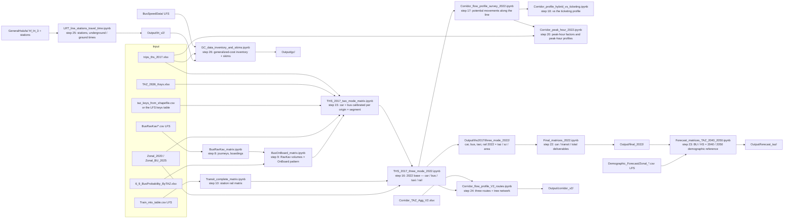

# Nofit LRT Extension — OD Demand Matrix

Builds an AM-peak (06:00–09:00) origin–destination demand matrix for the Nofit LRT
extension study area (778 TAZs, northern Israel) from the 2018 Travel Habits Survey,
with the bus layer calibrated to RavKav ticketing and the OnBoard survey, and compares
it against a cellular-derived OD matrix.

**Status (21 September 2026).** The repository holds three generations of matrices. The
**authoritative base-year product is the survey-only 2022 layer set** under
`Output/ths2017/three_mode_2022/` (car / bus / taxi-type / rail). The survey × cellular
hybrids are **historical**, and the 2040 / 2050 forecasts and LRT-market tables are a
**demographic reference built on an older 25-area composite**, not on the current base —
they are to be rebuilt. [METHODOLOGY.md §0](METHODOLOGY.md#0-status-authoritative-baseline-and-lineage-21-september-2026)
carries the lineage table that says, for every published file, what it was built from
and whether it is current, and a conclusions table for the corridor. **Headline corridor
results (2022 layers):** corridor-to-corridor trips 72,331 car / 9,366 bus / 3,812
taxi-type (bus share 11 %); busiest transit link ≈ 1,650 potential movements per
direction over 06:00–09:00; **peak hour 07:00–08:00 holding 59–66 % of the three hours
(1.8 × an average hour)**, so ≈ 980 transit and 4,200–4,600 all-layer potential
movements per direction on the busiest links in the peak hour. These are screening
quantities, not loads. **Car and transit share the dominant destination structure in the
survey but transit is less local and more Haifa-bound** (PCA, METHODOLOGY §6s): the
transit market cannot be read off the car pattern by scaling, which is why the base keeps
a transit-specific destination pattern. The plain-language account is
[`reports/Survey_Matrices_Car_Bus_Rail_Report.docx`](reports/Survey_Matrices_Car_Bus_Rail_Report.docx)
(revision 2.1). **22 September 2026:** the corridor was re-analysed on the **V2 aggregation**
(25 areas, three routes T1 Nazareth / T2 Krayot / T3 Kiryat Yam on a common trunk —
[METHODOLOGY §6v](METHODOLOGY.md#6v-step-24--corridor-potential-movements-on-the-v2-aggregation-three-routes-corridor_flow_profile_v2_routesipynb));
the planned **LRT line and its 24 stations** were given station-to-station times with a
calibrated function for an all-underground and an all-ground scenario (73.5 / 89.7 min end to
end in distance form, 45 / 55 min in section form — [§6w](METHODOLOGY.md#6w-step-25--lrt-line-and-stations-stop-to-stop-times-underground-vs-ground-level-lrt_line_stations_travel_timeipynb));
and the **generalized-cost inputs** were inventoried and first-filled on the V2 areas, with
the gaps listed in `Output/gc/gc_data_inventory.csv` ([§6x](METHODOLOGY.md#6x-step-26--generalized-cost-on-the-v2-areas-data-inventory-first-fill-skims-gaps-gc_data_inventory_and_skimsipynb)); the **bus and Metronit level of service per TAZ** from the national GTFS of 22 May 2026 ([§6aa](METHODOLOGY.md#6aa-step-29--bus-level-of-service-per-taz-from-the-national-gtfs-bus-and-brt-gtfs_bus_los_tazipynb)) now supplies the bus in-vehicle time, wait and stop access of that inventory. The external methodology review that prompted this
(`docs/Nofit_Demand_Methodology_Review.md`, 21 Sep 2026) and the response to it are recorded
in [METHODOLOGY.md §8](METHODOLOGY.md#8-known-caveats-and-open-questions) and
[CORRIDOR_DEMAND_TASKS.md](docs/CORRIDOR_DEMAND_TASKS.md).

See **[METHODOLOGY.md](METHODOLOGY.md)** for the full reasoning, methodology, inputs and
outputs of every step, **[TRANSIT_DEMAND_PLAN.md](docs/TRANSIT_DEMAND_PLAN.md)** for the
(historical) ticketing-substitution decision, **[CORRIDOR_DEMAND_TASKS.md](docs/CORRIDOR_DEMAND_TASKS.md)**
for the open task list, and **[LRT_CAPTURE_PLAN.md](docs/LRT_CAPTURE_PLAN.md)** for the
generalised-cost capture model still to be built.

## Current pipeline (survey-only branch)



Historical branches (kept, not consumed by the current base): the 2018 activities-file
hybrid (`THS_2018_MTX_*`), the 2017 trips-file hybrid (`THS_2017_hybrid_pipeline`), the
25-area ticketing composite (`Vintage_alignment_2022`) and everything downstream of it
(`Forecast_matrices_2040_2050`, `Base_mode_shares_2022`, `NoBuild_and_LRT_market`,
`LRT_alignment_markets`).

## Repository layout

```
README.md, METHODOLOGY.md      what the repository is and, step by step, what was done
docs/                          plans, the forecast methodology, the open task list and the external review
notebooks/current/             the survey-only chain and its inputs (steps 5, 7–10, 15–18, 20) and the scenario comparison
notebooks/diagnostics/         similarity tests, PCA suites and the conservation test — evidence, not products
notebooks/historical/          the survey × cellular hybrids and the 25-area composite / forecast branch — superseded, kept as record
reports/                       Survey_Matrices_Car_Bus_Rail_Report.docx (current); reports/historical/ for the older ones
Input/                         survey, ticketing, zonal and key files (large ones in Git LFS; committed substitutes noted in METHODOLOGY §1)
Output/                        products by chain: ths2017/two_mode, ths2017/three_mode_2022 (current); bus, train (current inputs);
                               ths2017/study_taz, historical/ths2018, transit, forecast (historical); ths2017/tests, figures (diagnostics)
```

Every notebook's first cell moves the working directory to the repository root, so all
`Input/…` and `Output/…` paths are root-relative and a notebook can be executed from
anywhere inside the repository.

## Notebooks

| Notebook (folder = status) | Status | What it does |
|---|---|---|
| `THS_2018_MTX.ipynb` | historical | Original analysis: unweighted survey matrices, first comparison against cellular |
| `THS_2018_MTX_weighted.ipynb` | historical | Day 10 / Day 20 matrices with household expansion weights (`wf_new`) — ~2.3M expanded trips per day |
| `THS_2018_MTX_weighted_by_mode.ipynb` | historical | Weighted matrices by aggregated mode (CAR / TRANSIT / RAIL / OTHER) |
| `THS_2018_MTX_submatrix.ipynb` | historical | 119×119 sub-area versions of the weighted matrices |
| `THS_2018_MTX_trip_generation.ipynb` | historical | AM-peak trip generation rates per person by home TAZ / superzone |
| `THS_2018_MTX_weighted_vs_cellular.ipynb` | diagnostic | Weighted matrices vs cellular: superzone r ≈ 0.855; the intra-zone divergence (survey 72 % vs cellular 34 % self-containment) |
| `THS_2018_MTX_PCA_vs_cellular.ipynb` | diagnostic | PCA test suite on survey vs cellular (shared top-12 destination-choice patterns; the diagonal carries most of the divergence) |
| `THS_2018_MTX_hybrid.ipynb` | historical | Superzone hybrid via empirical-Bayes shrinkage, k by cross-day validation |
| `THS_2018_MTX_hybrid_taz.ipynb` | historical | 778-TAZ hybrid: superzone correction factors on cellular cells, row-normalised — **does not reproduce its superzone OD blocks** (see `Hybrid_superzone_conservation_test.ipynb`) |
| `THS_2018_MTX_GS.ipynb` | historical | The same pipeline on the 25-zone GS zoning |
| `THS_2017_PCA_vs_cellular.ipynb` | diagnostic | The PCA suite on the trips-file source |
| `THS_PCA_eigenvector_maps.ipynb` | diagnostic | Eigenvector charts for the PCA suite; exports `Output/pca_sz_eigenvectors.csv` |
| `THS_PCA_review_tests.ipynb` | diagnostic | Direct tests answering the PCA report review (conditional outbound distributions, household bootstrap, diagonal audit) |
| `THS_2017_PCA_car_vs_transit.ipynb` | diagnostic | PCA within the survey with the mode group as the grouping: car and transit share the dominant destination structure (overlap 0.75 at superzone level, 0.83 on well-sampled origins ≈ transit's own repeatability), but transit is less local (self-containment 0.45 vs 0.62) and shifts share to the Haifa core (common direction, p = 0.04) — a transit market cannot be read off the car pattern by scaling; also run on the 28 corridor areas (at transit's noise floor), TAZ × superzone (0.75 vs repeatability 0.89, common direction p = 0.002) and TAZ × TAZ (0.27 vs 0.55: only the coarse geography is shared) (METHODOLOGY §6s) |
| `Cellular_eigenplaces_TAZ.ipynb` | diagnostic | Eigenplaces-style temporal typology of the TAZs from the 24-hour cellular trip-end profiles (PCA + k-means → four functional types, checked against 2020 demographics); the survey–cellular self-containment gap concentrates in the residential types — evidence for the short-trip hypothesis (METHODOLOGY §8b); needs the LFS cellular file |
| `THS_2017_trips_matrices.ipynb` | current (survey source) | Day × mode + day-averaged matrices from `Input/trips_ths_2017.xlsx`, converted to the study zone systems by cellular allocation shares |
| `THS_2017_hybrid_pipeline.ipynb` | historical | Survey × cellular hybrid on the trips-file source (k* = 5), correction-factor TAZ matrices, 28-area sub-matrices |
| `Hybrid_superzone_conservation_test.ipynb` | **test** | Reaggregates the TAZ hybrids to superzone OD blocks (primary: 55 of 627 blocks > 100 trips off by > 10 %, worst +49 %), then rebalances the primary hybrid to superzone blocks and TAZ origin totals jointly (IPF, 1 % of trips relocated) → `hybrid_taz_trips_balanced.csv`, with a pass/fail assertion |
| `THS_2017_cosine_GEH_tests.ipynb` | diagnostic | Cosine similarity and GEH on survey / cellular / hybrid at four resolutions; the scale audit (survey 3.56 × cellular AM volume) |
| `THS_2017_KS_tests.ipynb` | diagnostic | Kolmogorov–Smirnov on trip length and flow concentration (survey median 1.95 km vs cellular 7.6 km) |
| `THS_2017_MSSIM_tests.ipynb` | diagnostic | Structural similarity (MSSIM) in Hilbert-curve order; raw-trip MSSIM is uninformative, log-scale survey vs cellular 0.13 at TAZ level |
| `THS_2017_two_mode_matrix.ipynb` | **current** | Survey-only car / transit matrices, cellular-free (population / employment TAZ split); bus calibrated to RavKav × OnBoard — EB-blended superzone pattern (k* = 5 by household-split validation) and RavKav volumes per **origin superzone × destination segment** (local / corridor-bound / other) where the ticketing / survey ratio is ≥ 0.5, survey volumes where it is not; binary-guard, all-RavKav and uniform-factor variants and a threshold sweep saved alongside |
| `THS_2017_three_mode_2022.ipynb` | **current** | Moves the two-mode set to a 2022 base at TAZ level and splits it into **car / bus / taxi-type / rail** (car Furnessed to growth margins, RavKav-volume bus cells as the anchor, guarded cells and taxi grown, rail × the national ridership series) |
| `Corridor_flow_profile_survey_2022.ipynb` | **current** | Directional link profiles of **three-hour potential movements** along the corridor — total, transit (bus + rail) and taxi-type — with the earlier profiles overlaid |
| `Corridor_profile_hybrid_vs_ticketing.ipynb` | **current** | Link-by-link comparison of the calibrated-survey transit profile with the ticketing-based one (components, calibration steps, area pairs driving the differences, transit share, local-vs-intercity ticketing coverage) |
| `Forecast_matrices_TAZ_2040_2050.ipynb` | **current** (dry run here) | Grows the final 2022 layers to BU / HS × 2040 / 2050 at TAZ level as a demographic reference: composite land-use indices, own-rate / superzone-rate margins with a small-base rule, own-pattern / superzone-pattern seed, Furness per layer (`docs/FORECAST_METHODOLOGY_2040_2050.md`); runs the four scenarios once the LFS zonal files are pulled |
| `Final_matrices_2022.ipynb` | **current** | Assembles the deliverable 2022 TAZ matrices (car, transit = bus + rail, total = car + transit, taxi-inclusive variants, long format) from the step-16 layers with additivity checks and a manifest |
| `Corridor_peak_hour_2022.ipynb` | **current** | Peak-hour factors from the survey's minute-level departure times (peak hour 07:00–08:00; PHF₃ₕ ≈ 0.59–0.66, i.e. 1.8 × an average hour; household-bootstrap ranges) and the 2022 link profiles in peak-departure-hour terms, with a sensitivity to the bus factor basis |
| `Corridor_flow_profile_V2_routes.ipynb` | **current** | The corridor potential movements on the **V2 aggregation** (25 areas, 174 TAZs): per route (T1 Nazareth, T2 Krayot, T3 Kiryat Yam) and on the tree network, three-hour and peak-hour, all layers; the Krayot branch link Kiryat Haim – Kiryat Bialik Center is the busiest single link (10,144 towards Haifa), the trunk link Bazan-Hutsot – Tsomet Kiryat Ata carries 16,231 / 2,898 transit on the network (METHODOLOGY §6v) |
| `Corridor_peak_hour_V2_routes.ipynb` | **current** | Peak-hour factors re-estimated on the V2 route sequences and the tree network (car by direction on every route, 0.62–0.65 up / 0.57–0.58 down, network 0.56 / 0.52; bus and taxi-type on the study-area factors); step 24 applies them (§6y) |
| `Corridor_profile_V2_survey_vs_ticketing.ipynb` | **current** | The calibrated-survey vs ticketing-based transit profiles on the V2 routes and the tree network, from the TAZ-level products: up direction agrees (0.78–0.83), down direction route-specific (T2 0.92, T1 0.66), the Nazareth allocation and the alighting frame still the drivers (§6z) |
| `GTFS_bus_LOS_TAZ.ipynb` | **current** | Bus level of service per TAZ from the national GTFS (stops, lines, peak-hour departures and combined headway with a TCQSM grade, direct reach, stop access) for all buses and for the **Metronit BRT** lines (codes 83001–83005) separately, with a BRT-access flag per TAZ; a direct-service in-vehicle time and headway skim between the V2 areas that now feeds the bus components of the generalized cost (§6aa); feed of 22 May 2026, Tuesday 2 June; 719 of 781 TAZs served in the peak hour, 60 with a Metronit stop; the Metronit codes in the feed are 83001, 67002, 67003, 62004, 52005 |
| `LRT_line_stations_travel_time.ipynb` | **current** | The planned line `hf_lrt_3` and its 46 platform points → 24 stations with chainage, TAZ and V2 area; station-to-station in-vehicle times with the calibrated function (1.961 min per 500 m underground, 2.393 at ground level) for an all-underground and an all-ground scenario, distance and section forms; area-level times for the ten trunk areas (§6w) |
| `GC_data_inventory_and_skims.ipynb` | **current** | Generalized-cost components on the V2 areas: car door-to-door from the survey, bus fastest-path IVT on the May 2026 speed network (2.1–2.3 × below the survey's door-to-door), LRT IVT + walk access from step 25; partial GC matrices with a status per cell and the data-gap inventory — LRT speed on this spacing and the branch geometry are the decisive open inputs (§6x) |
| `THS_2017_trip_generation.ipynb` | current | Per-person AM-peak generation rates on the trips-file source (overall ≈ 0.83) |
| `BusRavKav_matrix.ipynb` | current | RavKav bus data: stop → TAZ tagging, weekday-3 / 06–09 filter, average-Tuesday journey OD and per-TAZ boardings / alightings |
| `BusOnBoard_matrix.ipynb` | current | OnBoard survey probability matrix + RavKav volumes × OnBoard destination pattern (the unit of the OnBoard rows — boarding leg or journey — is still to be confirmed) |
| `Transit_complete_matrix.ipynb` | current for rail / historical for the composite | Station-to-station train matrix (2019 smartcards, 06–09); the bus + train composite and adjusted all-mode matrix are historical |
| `Vintage_alignment_2022.ipynb` | historical | Levels the 25-area composite to 2022 |
| `Demographic_scenario_comparison.ipynb` | current (input analysis) | BU vs HS forecast scenarios (2040 / 2050) at the 28 research areas: growth location differs sharply; each scenario needs its own matrix |
| `Forecast_matrices_2040_2050.ipynb` | historical (superseded by step 23) | Grows the 25-area 2022 composite to BU/HS × 2040/2050 by IPF on demographic margins — zero cells preserved, base is the historical composite |
| `Base_mode_shares_2022.ipynb` | demographic reference (to be rebuilt) | Revealed 2022 modal shares of the composite, EB-smoothed with k = 50 applied to expanded volumes (which act as counts of thousands, so the smoothing is nearly inert) |
| `NoBuild_and_LRT_market.ipynb` | demographic reference (to be rebuilt) | Frozen-share no-build modal matrices per scenario-year and the LRT core / extended market definition |
| `LRT_alignment_markets.ipynb` | demographic reference (to be rebuilt) | Market counts for the two alignment scenarios per forecast scenario-year |

## Key deliverables (`Output/`)

- `forecast_taz/{BU,HS}_{2040,2050}/` — the 2040 / 2050 demographic-reference matrices
  (car, transit, taxi-type, total), produced by step 23 after the LFS scenario files are
  pulled; `forecast_taz/dry_run/` holds the mechanics test run here
  ([docs/FORECAST_METHODOLOGY_2040_2050.md](docs/FORECAST_METHODOLOGY_2040_2050.md))
- **`final_2022/{car,transit,total}_2022_taz.csv`** — the deliverable 778×778 matrices for
  2022 (transit = calibrated bus + rail; total = car + transit; taxi-inclusive variants,
  a gzip long-format file for SQL, `MANIFEST.csv` and `final_2022_summary.csv` alongside;
  [METHODOLOGY §6t](METHODOLOGY.md#6t-step-22--final-2022-taz-matrices-car-transit-total-final_matrices_2022ipynb))
- `ths2017/three_mode_2022/{car,bus,taxi,rail}_2022_{taz,sz,area}.csv` — **the current
  2022-base layer set** (778×778; superzone and 28-area versions alongside);
  `all_modes_2022_taz.csv` is their sum ([METHODOLOGY.md §6n](METHODOLOGY.md#6n-step-16--2022-base-layers-car-bus-taxi-type-rail-ths_2017_three_mode_2022ipynb))
- `ths2017/three_mode_2022/corridor_link_flows_{total,transit,taxi}_2022.csv`,
  `corridor_profile_hybrid_vs_ticketing.csv` — three-hour potential movements along the
  line and the comparison with the ticketing profile (§6o, §6p)
- `ths2017/three_mode_2022/peak_hour_factors*.csv`, `corridor_link_flows_peak_hour_2022.csv`
  — peak-hour factors and the link profiles in peak-hour terms (§6r)
- **`corridor_v2/`** — the V2-aggregation area matrices and the per-route / tree-network link
  flows, three-hour and peak-hour (`corridor_v2_link_flows_long.csv`,
  `corridor_v2_network_link_flows.csv`, `corridor_v2_route_summary.csv`; §6v), the V2 peak-hour
  factors (`peak_hour_factors_v2*.csv`; §6y) and the survey-vs-ticketing comparison
  (`corridor_v2_survey_vs_ticketing*.csv`; §6z)
- **`lrt_v2/`** — the station table (`lrt_stations_hf_lrt_3.csv` / `.geojson`) and the
  station-to-station times `lrt_station_times_{all_underground,all_ground}.csv` (§6w)
- **`gc/`** — the generalized-cost skims and inventory: `gc_components_area_v2_long.csv`
  (every component, mode and cell with its status), `gc_area_v2_*.csv`, and
  `gc_data_inventory.csv`, the list of what is still missing (§6x)
- `ths2017/two_mode/` — the 2018-base car / bus / transit matrices, the calibration tables
  (`bus_calibration_factors_segments.csv` is the segmented coverage rule;
  `bus_calibration_threshold_sensitivity.csv` the threshold sweep) and the variants (§6m)
- `ths2017/tests/hybrid_sz_conservation_*.csv`, `ths2017/study_taz/hybrid_taz_trips_balanced.csv`
  — the superzone conservation test and the rebalanced hybrid (§6q)
- `ths2017/tests/cosine_geh_summary.csv`, `ks_summary.csv`, `mssim_headline.csv` — the
  survey / cellular / hybrid diagnostics (§6j–§6l); `pca_car_vs_transit_*.csv` — the
  car-vs-transit PCA within the survey (§6s)
- `ths2017/study_taz/hybrid_*`, `historical/ths2018/*`, `transit/`, `forecast/` — historical
  and demographic-reference products; see the lineage table in METHODOLOGY §0 before use

## Reports

- `reports/V2_Corridor_LRT_Times_and_GC_Inputs_Report.docx` — **revision 1, 22 September 2026**: the
  corridor on the V2 aggregation (three routes and the tree network, peak hour, survey vs
  ticketing), the LRT line's station-to-station times under the underground and ground-level
  scenarios, the generalized-cost inventory and first fill, and — Part D — what every matrix
  product in the repository can and cannot be used for
- `reports/Survey_Matrices_Car_Bus_Rail_Report.docx` — **revision 2.1, 21 September 2026**: the
  current base in plain language (survey-only matrix, tests, segmented bus calibration,
  2022 layers, corridor potential movements and their peak hour, what changed since revision 1 and why)
- `reports/historical/Nofit_LRT_OD_Demand_Report.docx` (8 September 2026) — kept as a record with a dated
  status note at the front saying which parts are overtaken (its stale PDF rendering was
  removed)
- `reports/historical/Demographic_Scenario_Comparison_Report.docx` — the BU / HS scenario comparison, with a
  status note on the forecast branch's lineage
- `reports/historical/PCA_Eigenvector_Report.docx`, `reports/historical/PCA_Eigenvector_Report_Hebrew_Explainer.docx`,
  `reports/historical/PCA_Comparison_Hebrew_Explainer.docx` — the PCA diagnostics, unchanged
- `docs/Nofit_Demand_Methodology_Review.md` — the external review of 21 September 2026 that
  the revision responds to
- Full inventory in [METHODOLOGY.md §7](METHODOLOGY.md#7-output-inventory-output)

## Setup

Since 22 September 2026 every file directly under `Input/` is stored in Git LFS (the
survey workbook, the keys, the zonal files, the V2 aggregation), as are the GTFS and
bus-speed archives, so a pull of the small inputs is required before any notebook runs:

```bash
pip install pandas numpy scipy matplotlib jupyter openpyxl pyshp shapely pyproj
git lfs pull --include="Input/*.xlsx,Input/*.csv"                       # required (≈ 22 MB)
git lfs pull --include="Input/GTFS/israel-public-transportation.zip"   # step 29 (181 MB)
git lfs pull --include="Input/BusSpeedData/std_202605.csv"             # step 26 (311 MB)
git lfs pull                                                           # everything: cellular, RavKav, train, forecast zonal files
```

Run order for the current branch, all under `notebooks/current/`: `THS_2017_two_mode_matrix`
→ `THS_2017_three_mode_2022` → `Corridor_flow_profile_survey_2022` →
`Corridor_profile_hybrid_vs_ticketing` → `Corridor_peak_hour_2022` → `Final_matrices_2022` →
`Forecast_matrices_TAZ_2040_2050` (see METHODOLOGY §9); then, on the new inputs,
`Corridor_peak_hour_V2_routes` → `Corridor_flow_profile_V2_routes` → `Corridor_profile_V2_survey_vs_ticketing`
→ `LRT_line_stations_travel_time` → `GTFS_bus_LOS_TAZ` → `GC_data_inventory_and_skims`
(the last two need the GTFS and bus-speed LFS files; step 26 reads step 29's skim).
`notebooks/diagnostics/Hybrid_superzone_conservation_test` runs on committed outputs alone.
