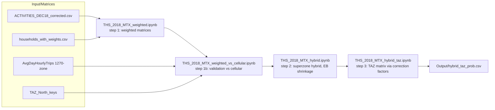

# Nofit LRT Extension — OD Demand Matrix

Builds an AM-peak (6:00–9:00) origin–destination demand matrix for the Nofit LRT
extension study area (778 TAZs, northern Israel) by fusing the 2018 Travel Habits
Survey with a cellular-derived OD matrix: cellular acts as the population-scale prior,
the survey as evidence, combined at the spatial scale where each is reliable.

See **[METHODOLOGY.md](METHODOLOGY.md)** for the full reasoning, methodology, inputs
and outputs of every step, and **[TRANSIT_DEMAND_PLAN.md](TRANSIT_DEMAND_PLAN.md)**
for the agreed plan to complete the corridor transit demand once the train matrix
arrives, and **[CORRIDOR_DEMAND_TASKS.md](CORRIDOR_DEMAND_TASKS.md)** for the open task
list that makes the base-year matrix fit for corridor demand estimation and 2050 growth.

## Pipeline



## Notebooks

| Notebook | What it does |
|---|---|
| `THS_2018_MTX.ipynb` | Original analysis: unweighted survey matrices, first comparison against cellular |
| `THS_2018_MTX_weighted.ipynb` | Recreates the Day 10 / Day 20 matrices with household expansion weights (`wf_new`) — ~2.3M expanded trips per day |
| `THS_2018_MTX_weighted_by_mode.ipynb` | Splits the weighted matrices by aggregated mode (CAR / TRANSIT / RAIL / OTHER) from `MODE_NAME` |
| `THS_2018_MTX_submatrix.ipynb` | Extracts 119×119 sub-area versions of the weighted matrices (all modes + mode groups) |
| `THS_2018_MTX_trip_generation.ipynb` | AM-peak trip generation rates per person by home TAZ / superzone, home = Home activity at 3:00 AM (overall ≈ 0.84, model-area trips) |
| `THS_2018_MTX_weighted_vs_cellular.ipynb` | Validates the weighted matrices against cellular: superzone r ≈ 0.855; identifies the systematic intra-zone divergence (survey 72% vs cellular 34% self-containment) |
| `THS_2018_MTX_PCA_vs_cellular.ipynb` | PCA test suite on survey vs cellular: shared top-12 superzone destination-choice patterns (subspace overlap 0.76 vs 0.90 day-to-day ceiling, permutation p ≈ 0.0005), the same two leading components in swapped variance order, divergence confined to zone-specific self-containment (88% of squared divergence on the diagonal) |
| `THS_2018_MTX_hybrid.ipynb` | Superzone hybrid via empirical-Bayes shrinkage, with the shrinkage constant chosen by cross-day validation |
| `THS_2018_MTX_hybrid_taz.ipynb` | Final 778-TAZ matrix: superzone correction factors R_AB applied to cellular OD cells, row-normalized |
| `THS_2018_MTX_GS.ipynb` | The same pipeline on the GS zoning (25 zones, `Input/TAZ_GSnew.csv`): GS matrices, GS hybrid, and GS-calibrated TAZ matrices |
| `THS_2017_PCA_vs_cellular.ipynb` | The PCA suite re-run on the trips-file source (day 1 / day 2 converted to study zones with the pipeline's allocation chain): every structural conclusion replicates (overlap 0.76, congruences 0.97/0.90, 87% of divergence on the diagonal), against higher internal-consistency ceilings (SZ 0.94, TAZ 0.60) — corroborating the trips file as the cleaner, primary source |
| `THS_PCA_eigenvector_maps.ipynb` | Eigenvector charts for the PCA suite: the top-4 components drawn as destination-loading maps and origin-score maps on the superzone geography (cellular vs survey day 10 / day 20 / 2017, Hungarian-matched and sign-aligned), ranked loading bars, biplots, axis-meaning checks and a reconstruction-fit check; exports `Output/pca_sz_eigenvectors.csv` |
| `THS_PCA_review_tests.ipynb` | Review follow-up with direct tests: conditional outbound distributions q(j\|i) survey vs cellular (TV ≈ 0.31, ≈ 2.3× the sampling-noise expectation — the divergence is not only on the diagonal, and the hybrid carries the survey's outbound pattern), household bootstrap of the 2017 trips file (congruence spreads), spectrum-flattening decomposition (the survey's flat spectrum is its diagonal's doing, not noise), diagonal audit (intra-superzone trips are real, short: median 0.7 km), within-superzone destination check at 1250-zone resolution for the corridor superzones, and what the absolute totals rest on |
| `THS_2017_trips_matrices.ipynb` | Independent day × mode + day-averaged matrices from `Input/trips_ths_2017.xlsx` (placeno-ordered activities, Dep_h 6–8, `new_wf` weights), converted to the study zone systems |
| `THS_2017_hybrid_pipeline.ipynb` | **Primary fusion products** on the trips-file source: SZ/GS hybrids (k* = 5 by cross-day CV), correction-factor TAZ matrices, trips, and 119-TAZ submatrices |
| `THS_2017_cosine_GEH_tests.ipynb` | Cosine similarity and GEH tests on the three matrices (trips-file survey days 1 / 2, cellular, hybrid) at SZ / GS / 28-area / TAZ level, against the day-1-vs-day-2 ceiling and a permuted-geography null; includes the survey-vs-cellular scale audit (survey 3.56 × cellular AM volume, driven by intra-zone trips) and corridor-class GEH |
| `THS_2017_KS_tests.ipynb` | Kolmogorov–Smirnov tests on the same three matrices: trip length distributions (centroid km; all cells, off-diagonal, per origin superzone, corridor classes) and flow-concentration curves, judged against the day-1-vs-day-2 `D` and a household bootstrap — survey median 1.95 km vs cellular 7.6 km (`D` = 0.42, still 0.30 with every intra-cellular-zone cell removed), hybrid 3.8 km |
| `THS_2017_MSSIM_tests.ipynb` | Structural similarity (MSSIM, Djukic et al.) on the same three matrices in Hilbert-curve zone order, by window size and scale, with luminance / contrast / structure decomposition, local SSIM maps and superzone blocks, against the day-1-vs-day-2 ceiling and a broken-correspondence null — raw-trip MSSIM is uninformative (≈ 0.99 for every pair and for the null); on the log scale survey vs cellular is 0.13 at TAZ level (ceiling 0.81, null 0.02), the hybrid 0.48 vs cellular and 0.94 vs the survey at superzone level |
| `THS_2017_two_mode_matrix.ipynb` | Survey-only two-mode matrix (car / transit) from the trips file, cellular-free (population / employment TAZ split), with the bus part calibrated to RavKav × OnBoard: EB-blended superzone destination pattern (k\* = 5 by household-split validation) and RavKav origin volumes with a coverage guard — the ticketing extract sees only 0.2–0.4 of the survey's bus trips in the Nazareth, Shefa-'Amr, Sakhnin and other mostly Arab-sector / peripheral superzones, so those keep survey volumes |
| `THS_2017_three_mode_2022.ipynb` | Moves the survey-only two-mode matrix to a 2022 base at TAZ level (car Furnessed to population / employment growth margins, RavKav-calibrated bus rows as the anchor, guarded rows and taxi-type grown, rail × the national ridership series) and splits it into **car / bus / rail** matrices |
| `Corridor_flow_profile_survey_2022.ipynb` | Directional link-flow profiles along the corridor for the survey-only 2022 matrices — total (car + bus + rail) and transit only — with the earlier hybrid- / ticketing-based profiles overlaid |
| `Corridor_profile_hybrid_vs_ticketing.ipynb` | Link-by-link comparison of the calibrated-survey transit profile with the ticketing-based one (components, calibration steps, area pairs driving the differences, transit share of link flow, local-vs-intercity ticketing coverage) |
| `THS_2017_trip_generation.ipynb` | Per-person AM-peak generation rates on the trips-file source (overall ≈ 0.83), by 2636-zone / SZ / GS |
| `BusRavKav_matrix.ipynb` | RavKav bus data: stop→TAZ spatial tagging, weekday-3 / 6–9 AM filter, average-Tuesday OD matrix and per-TAZ boardings/alightings |
| `BusOnBoard_matrix.ipynb` | OnBoard survey probability matrix + combined bus matrix (RavKav volumes × OnBoard destination pattern) |
| `Transit_complete_matrix.ipynb` | Train matrix (2019 smartcards, 6–9), complete transit matrix (bus+train), adjusted all-mode matrix and mode shares |
| `Vintage_alignment_2022.ipynb` | Levels all components to a 2022 base: CAR/OTHER Furnessed to demographic growth margins (zonal 2020/2025 files), train scaled to 2022 rail ridership, bus as anchor |
| `Demographic_scenario_comparison.ipynb` | BU vs HS forecast scenarios (2040/2050) compared on the Furness-margin resolution (28 research areas): corridor totals match but spatial allocation diverges sharply — verdict: **each scenario needs its own matrix** |
| `Forecast_matrices_2040_2050.ipynb` | Grows the 2022 all-modes area matrix to the four scenario-years (BU/HS × 2040/2050) via IPF with demographically grown margins (population → origins, employment → destinations, constant trip rates, explicit new-resident productions for HS's residential conversions) |
| `Base_mode_shares_2022.ipynb` | Revealed per-OD modal shares (car/other, bus, rail) from the 2022 components, EB-smoothed toward corridor-class × distance-band strata — the no-build behavioral baseline for the LRT-capture step |
| `NoBuild_and_LRT_market.ipynb` | No-build modal matrices per scenario-year (pivot of smoothed base shares onto forecast totals — modes are never grown independently) and the LRT market definition (core = both ends corridor, 38–44% of trips; extended = one end) |
| `LRT_alignment_markets.ipynb` | Market counts for the two alignment scenarios (`Input/lrt_alignment_flags.csv`): MainCorridor (Hamifrats–Tirat Carmel + transfer-influenced Krayot, 23–31% of trips) vs FullLength (Nazareth–Tirat Carmel, ~56%), per forecast scenario-year |

## Key deliverables (`Output/`)

- `ths2017/study_taz/hybrid_taz_prob.csv` / `hybrid_taz_trips.csv` — **primary**
  TAZ-level OD hybrid (778×778, trips-file source; 28-area sub-matrices under
  `ths2017/study_taz/submatrices/`)
- `hybrid_taz_prob.csv` / `hybrid_taz_trips.csv` — activities-based versions
  (historical)
- `hybrid_taz_prob_k100.csv` — variant with a stronger cellular floor on
  survey-unobserved OD pairs
- `hybrid_sz_prob.csv` / `hybrid_sz_trips.csv` — superzone hybrid (probabilities /
  average-weekday trips)
- `trip_generation_summary.csv` — per home TAZ: SuperZone, AM-peak trips per person,
  expanded population
- `pca_sz_eigenvectors.csv` — top-6 superzone eigenvectors (destination loadings) and origin
  scores per source, matched to cellular and sign-aligned; charts in `figures/pca_eigenvector_*.png`
  and the write-up in `PCA_Eigenvector_Report.docx` (revised after review; the review's tests are in `THS_PCA_review_tests.ipynb`, figures `figures/pca_review_*.png`; plain-language Hebrew version in `PCA_Eigenvector_Report_Hebrew_Explainer.docx`)
- `Survey_Matrices_Car_Bus_Rail_Report.docx` — plain-language report on the survey-only car / bus / rail matrices: methodology, the similarity tests (cosine / GEH, KS, MSSIM), the RavKav × OnBoard calibration and its coverage finding, and the move to 2022
- `ths2017/three_mode_2022/{car,bus,rail}_2022_taz.csv` — **2022-base car / bus / rail matrices** (778×778; superzone and 28-area versions alongside) built from the survey-only two-mode set ([METHODOLOGY.md §6n](METHODOLOGY.md#6n-step-16--three-mode-matrices-for-2022-car-bus-rail-ths_2017_three_mode_2022ipynb))
- `ths2017/two_mode/car_taz.csv`, `ths2017/two_mode/transit_taz.csv` — survey-only two-mode matrices (778×778, 2018 base), transit with the RavKav × OnBoard-calibrated bus layer (see [METHODOLOGY.md §6m](METHODOLOGY.md#6m-step-15--two-mode-matrix-from-the-trips-file-transit-calibrated-to-ravkav--onboard-ths_2017_two_mode_matrixipynb)); calibration tables and mode shares alongside
- `ths2017/tests/cosine_geh_summary.csv`, `ths2017/tests/ks_summary.csv`, `ths2017/tests/mssim_headline.csv` — headline cosine / GEH, KS and MSSIM tables per level and pair (details in
  `ths2017/tests/`, figures `figures/cosine_geh_*.png`, `figures/ks_*.png`, `figures/mssim_*.png`, write-ups in [METHODOLOGY.md §6j](METHODOLOGY.md#6j-step-12--cosine-similarity-and-geh-tests-on-the-three-matrices-ths_2017_cosine_geh_testsipynb) , [§6k](METHODOLOGY.md#6k-step-13--kolmogorovsmirnov-tests-on-the-three-matrices-ths_2017_ks_testsipynb) and [§6l](METHODOLOGY.md#6l-step-14--mssim-tests-on-the-three-matrices-ths_2017_mssim_testsipynb))
- Full inventory in [METHODOLOGY.md §7](METHODOLOGY.md#7-output-inventory-output)

## Setup

Input CSVs are stored in Git LFS:

```bash
git lfs pull
pip install pandas numpy matplotlib jupyter
```
