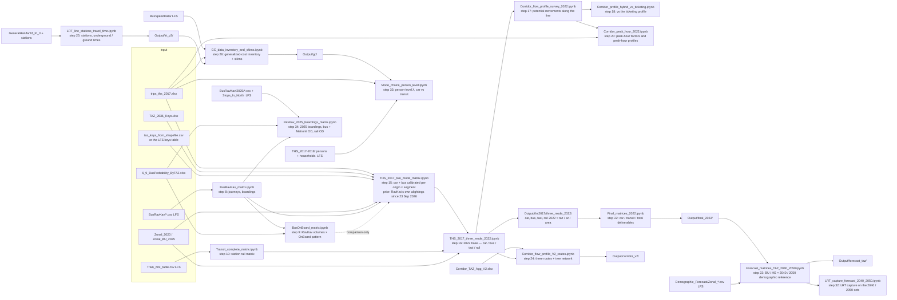

# Nofit LRT Extension — OD Demand Matrix

Builds an AM-peak (06:00–09:00) origin–destination demand matrix for the Nofit LRT
extension study area (778 TAZs, northern Israel) from the 2018 Travel Habits Survey,
with the bus layer calibrated to RavKav ticketing (the May 2022 journeys on RavKav's own
inferred alightings), and compares it against a cellular-derived OD matrix.

**Status (21 September 2026).** The repository holds three generations of matrices. The
**authoritative base-year product is the survey-only 2022 layer set** under
`Output/ths2017/three_mode_2022/` (car / bus / taxi-type / rail). The survey × cellular
hybrids are **historical**, and the 2040 / 2050 forecasts and LRT-market tables are a
**demographic reference built on an older 25-area composite**, not on the current base —
they are to be rebuilt. [METHODOLOGY.md §0](METHODOLOGY.md#0-status-authoritative-baseline-and-lineage-21-september-2026)
carries the lineage table that says, for every published file, what it was built from
and whether it is current, and a conclusions table for the corridor. **Headline corridor
results (2022 layers, rebuild of 23 September 2026 — corrected mode codes, step-15 prior on
RavKav's own alightings):** corridor-to-corridor trips 72,331 car / 10,255 bus / 313
taxi-type (bus share 12 %); busiest transit link ≈ 1,840 potential movements towards
Nazareth and ≈ 1,490 towards Tirat Carmel over 06:00–09:00; **peak hour 07:00–08:00 holding
59–66 % of the three hours (1.8 × an average hour)**, so ≈ 880–1,085 transit and
3,900–3,955 all-layer potential movements per direction on the busiest links in the peak
hour. These are screening
quantities, not loads. **Car and transit share the dominant destination structure in the
survey but transit is less local and more Haifa-bound** (PCA, METHODOLOGY §6s): the
transit market cannot be read off the car pattern by scaling, which is why the base keeps
a transit-specific destination pattern. The plain-language account is
[`reports/Survey_Matrices_Car_Bus_Rail_Report.docx`](reports/Survey_Matrices_Car_Bus_Rail_Report.docx)
(revision 2.1). **22 September 2026:** the corridor was re-analysed on the **V2 aggregation**
(25 areas, three routes T1 Nazareth / T2 Krayot / T3 Kiryat Yam on a common trunk —
[METHODOLOGY §6v](METHODOLOGY.md#6v-step-24--corridor-potential-movements-on-the-v2-aggregation-three-routes-corridor_flow_profile_v2_routesipynb));
the planned **LRT line and its 24 stations** were given station-to-station times with a
calibrated function for an all-underground and an all-ground scenario (40.7 / 65.8 min end to
end once the function is transferred through the Red Line's actual station spacing — [§6w](METHODOLOGY.md#6w-step-25--lrt-line-and-stations-stop-to-stop-times-underground-vs-ground-level-lrt_line_stations_travel_timeipynb));
and the **generalized-cost inputs** were inventoried and first-filled on the V2 areas, with
the gaps listed in `Output/gc/gc_data_inventory.csv` ([§6x](METHODOLOGY.md#6x-step-26--generalized-cost-on-the-v2-areas-data-inventory-first-fill-skims-gaps-gc_data_inventory_and_skimsipynb)); the **bus and Metronit level of service per TAZ** from the national GTFS of 22 May 2026 ([§6aa](METHODOLOGY.md#6aa-step-29--bus-level-of-service-per-taz-from-the-national-gtfs-bus-and-brt-gtfs_bus_los_tazipynb)) now supplies the bus in-vehicle time, wait and stop access of that inventory; and the **observed bus running times** of the trips routed over the measured May 2026 link speeds ([§6ab](METHODOLOGY.md#6ab-step-30--observed-bus-in-vehicle-time-gtfs-trips-routed-over-the-measured-bus-link-speeds-gtfs_bus_observed_timesipynb)) feed the bus components in turn. A **complete skim set per mode** (car, bus, Metronit, LRT underground / ground, the LRT extended to the fifteen off-line areas by a feeder composite (bus, or Metronit with a free transfer)) closes out the generalized-cost work and is compared with the observed 2022 flows ([§6ac](METHODOLOGY.md#6ac-step-31--mode-skim-matrices-and-the-flow-comparison-mode_skims_and_flow_comparisonipynb)): a logit fit of the 2022 cross-section cannot identify the cost sensitivity λ (wrong sign), so λ is assumed (0.03, range 0.02–0.05) to pivot an incremental-logit capture of LRT trips from bus and car — 4,250 underground / 3,207 ground / 5,095 in the specified 50 km/h design regime (06:00–09:00, central case with a 5-minute LRT premium and free LRT–Metronit transfers; 3,161–6,028 across the λ range for the underground case; values of the 23 September 2026 rebuild, see below) — loaded onto the trunk links against today's bus movements. **After step 23's four 2040/2050 scenario sets were produced (22 September 2026), step 32 reran this capture on them with the skims held fixed: central-case underground LRT trips grow to 5,390 / 6,094 (BU 2040 / 2050) and 5,598 / 6,516 (HS 2040 / 2050), the capture rate unchanged (LRT share of no-build transit stays 0.29–0.30 underground), and the busiest trunk link, Namal-Giborim → Hamifrats, reaches about 1,200 trips in the peak hour by HS 2050.** With the THS person and household tables in hand (23 September 2026), **step 33 estimates λ at the person level** ([§6ae](METHODOLOGY.md#6ae-step-33--person-level-mode-choice-the-cost-sensitivity-λ-with-car-availability-held-constant-mode_choice_person_levelipynb)): with car availability, purpose, age and sector held constant, λ = 0.035 per generalized minute (0.002–0.068), supporting the assumed 0.03, but for the licence holders in car-owning households it is not identified (0.008 ± 0.017); the same metadata shows the trips file's mode codes 4 (group taxi) and 5 (Matronit) are swapped in steps 15–32, so the Metronit had been sitting in the taxi-type layer; **steps 15–32 were rerun with the corrected codes the same day** (the corridor transit market 11,664 → 13,778, the central underground capture 3,332 → 4,114; METHODOLOGY §0 "Rerun" and §8, caveat 14). **RavKav 2025 (23 September 2026, step 34, [§6af](METHODOLOGY.md#6af-step-34--ravkav-2025-boardings-by-stop-and-taz-bus--metronit-od-on-the-onboard-pattern-rail-od-from-entry-and-exit-taps-ravkav_2025_boardings_matrixipynb)):** three smart-card extracts for 2025 (Metronit, rail, a national all-modes file) become a boarding layer on a representative Tuesday (42 Tuesdays averaged, holidays and the June war dropped): bus 88,728 journey origins + 2,911 transfer boardings, Metronit 13,078 + 1,029, a bus + Metronit journey OD on the 2022 RavKav alighting pattern (101,680 journeys; OnBoard-patterned variant kept beside it), a rail station-to-station OD measured from the entry and exit taps (20 northern stations, 23,408 entries a day) and boarding-hour peak factors (bus 0.475, Metronit 0.433 — flatter than the survey's 0.589). Stop codes repeat across operators and the transfer tag is not the 2022 journey linking (METHODOLOGY §8, caveat 16); the chain is not yet re-anchored on this layer. **The matrix tests rerun on today's products (step 35, [§6ag](METHODOLOGY.md#6ag-step-35--the-matrix-tests-rerun-ths-against-ravkav-2022-and-2025-and-the-pca-ths_vs_ravkav_2025_testsipynb-diagnostics)):** the survey's bus matrix and RavKav's own inferred alightings share the same destination structure at superzone level to within the survey's day-to-day noise (cosine 0.89, PCA overlap 0.81, KS D 0.05), while the RavKav matrices built on the OnBoard pattern — step 9's and the 2025 layer's — match the survey no better than chance and carry trips twice as long; the OnBoard pattern, not the ticketing volume, is what separates the ticketing products from the survey (METHODOLOGY §8, caveat 17). No new car matrix was built today. **The car layer was checked against road traffic counts for the first time (step 36, [§6ah](METHODOLOGY.md#6ah-step-36--the-car-layer-against-road-traffic-counts-cordon-screenlines-car_cordon_counts_validationipynb-diagnostics)):** on six closed cordons, without an assignment, the residents' car layer is 0.58–0.90 of the counted vehicles where the crossing links are mostly counted (0.61–0.66 on the metropolitan core and Tirat Carmel inbound), its directional split agrees with the counts within 0.08 except at the Haifa city cordon, and the road's busiest clock hour holds only 0.38–0.43 of 06:00–09:00 against 0.62 of the survey's departures, so the step-20 peak-hour factors are an upper bound (§8 caveat 18). **Step 15 was therefore rebuilt the same afternoon with RavKav's own alightings as its prior and steps 16–35 rerun** ([§0 "Rebuild"](METHODOLOGY.md#0-status-authoritative-baseline-and-lineage-21-september-2026), [§6m](METHODOLOGY.md#6m-step-15--survey-only-car--transit-matrices-with-a-ravkav-calibrated-bus-layer-ths_2017_two_mode_matrixipynb)): the held-out validation now prefers the ticketing pattern outright (k\* 2 → 100), the calibrated bus base is 115,430 (2018) → 117,961 (2022) instead of 127,185 → 130,779 — 8 % below the survey, the prior keeping the outer superzones' journeys local — while the corridor-internal transit market rose 13,778 → 14,133 and the survey and ticketing corridor profiles now agree along the whole line (the 2.5–3 × ticketing excess towards Tirat Carmel and from Nazareth was the OnBoard pattern; on RavKav's own alightings the Nazareth branch swaps sides, so it still needs a count); the central underground capture is 4,250 (rate unchanged), 3,207 ground, 5,095 design regime, and 5,390 / 6,094 / 5,598 / 6,516 on the forecast sets. **Every number in this README and in METHODOLOGY §6m–§6ag is from that rebuild.** **Bus wait and the non-direct transfer allowance (23 September 2026, task E3 / C4, [§6x addendum 6](METHODOLOGY.md#6x-step-26--generalized-cost-on-the-v2-areas-data-inventory-first-fill-skims-gaps-gc_data_inventory_and_skimsipynb)):** a data-consistency fix to the 178 non-direct bus pairs' transfer count leaves every capture number above unchanged (confirmed by an exact rerun); a new `BUS_WAIT_RULE` switch compares the default pooled bus headway against the single busiest line's own headway, which raises the central-case capture 13–16 % (4,250 → 4,879 underground) when applied — reported as an alternative under `Output/skims/bus_wait_best_line/`, not adopted as the central case. **Realistic LRT regime and headways (23 September 2026, task C5, [§6w](METHODOLOGY.md#6w-step-25--lrt-line-and-stations-stop-to-stop-times-underground-vs-ground-level-lrt_line_stations_travel_timeipynb) / [§6ac](METHODOLOGY.md#6ac-step-31--mode-skim-matrices-and-the-flow-comparison-mode_skims_and_flow_comparisonipynb) addenda):** an acceleration/braking allowance on the 50 km/h design regime (39.7 min end to end, close to the calibrated underground case) and a mixed alignment (Haifa core underground, rest at ground level, 56.1 min) bracket the realistic case between the two pure regimes; every regime loses 7–8 % of its central-case capture per 2.5-minute headway step (5 → 7.5 → 10 min). **Bus-network response (23 September 2026, task C7, scenario S3, [§6ac](METHODOLOGY.md#6ac-step-31--mode-skim-matrices-and-the-flow-comparison-mode_skims_and_flow_comparisonipynb) addendum):** the opposite bound from today's full-competition assumption — removing the trunk's parallel bus as an independent alternative once the LRT opens — raises the central case 21–64 % by regime (`Output/skims/bus_truncated/`), bracketing the real (partial) truncation the client's opening-year bus plan will fall between. **Observed design-hour factors (23 September 2026, task C11, [§6y](METHODOLOGY.md#6y-step-27--peak-hour-factors-on-the-v2-routes-corridor_peak_hour_v2_routesipynb) addendum):** steps 24, 27 and 31 now publish a count-based car factor (0.435) and a RavKav-boarding-based transit factor (0.4755) beside every survey-departure peak-hour column, not in place of it — both markedly flatter than the survey's 0.55–0.74, moving the trunk's peak-hour LRT loads to 0.865–1.041 of the survey-based figure depending on direction. **Synthetic branch alignments (23 September 2026, task C6, scenario S4, [§6w](METHODOLOGY.md#6w-step-25--lrt-line-and-stations-stop-to-stop-times-underground-vs-ground-level-lrt_line_stations_travel_timeipynb) / [§6ac](METHODOLOGY.md#6ac-step-31--mode-skim-matrices-and-the-flow-comparison-mode_skims_and_flow_comparisonipynb) addenda), until the client's drawings arrive:** one ground-level station per off-trunk area, connected in the V2 route order — central capture **3,639**, *lower* than the feeder-composite case (4,254), because for 14 of the 15 off-trunk areas a real bus/Metronit feeder turns out to be faster than this placeholder LRT branch (`Output/lrt_v2/lrt_branches_vs_feeder_gc.csv`), up to 92 minutes worse at Nazareth — mostly one station's walk access across a 38-TAZ area, not the running speed. A genuine finding about the placeholder, not an error: real drawings would very likely change this. Every trunk-pair result is unchanged exactly. **RavKav 2025 journeys chained from the taps (23 September 2026, task C9, step 41, [§6ai](METHODOLOGY.md#6ai-step-41--ravkav-2025-journeys-chained-from-the-taps-on-their-own-inferred-alightings-ravkav_2025_own_alightingsipynb-diagnostics-task-c9)):** a card-level chaining tried in place of the `JourneyTransfer` tag resolves an alighting for only 45.8 % of taps — 72.2 % of card-date groups tap once in the AM-only window, nothing to chain against — but its chained transfer share (27.5 %) sits far closer to 2022's own rate (a third of legs) than the file's tag (3.7 %), supporting the standing reading that the tag marks a fare-rule transfer, not a physical one. The chain is deliberately not re-anchored on the 2025 layer (§6af "Re-anchoring": the transfer tag's unit and a 2025 alighting inference are missing, and there is no 2025 car observation). The two reports under `reports/` (revisions 2.2 and 1.4) carry dated revision notes with the before / after values and `docs/PLAIN_ENGLISH_METHODOLOGY.md` an update chapter; their body text reads at the 22 September state. The external methodology review that prompted this
(`docs/Nofit_Demand_Methodology_Review.md`, 21 Sep 2026) and the response to it are recorded
in [METHODOLOGY.md §8](METHODOLOGY.md#8-known-caveats-and-open-questions) and
[CORRIDOR_DEMAND_TASKS.md](docs/CORRIDOR_DEMAND_TASKS.md).

**Next steps**, specified for hand-over (inputs, method, outputs, checks and documents per step, plus the repository conventions): [`docs/NEXT_STEPS_HANDOVER_2026-09-23.md`](docs/NEXT_STEPS_HANDOVER_2026-09-23.md). LFS inputs can be pulled without the git-lfs client with `tools/lfs_pull.py`.

See **[METHODOLOGY.md](METHODOLOGY.md)** for the full reasoning, methodology, inputs and
outputs of every step (and **[docs/PLAIN_ENGLISH_METHODOLOGY.md](docs/PLAIN_ENGLISH_METHODOLOGY.md)**
for the same content — every step's inputs, processing, formulas, outputs and test
results — walked through in plain language), **[TRANSIT_DEMAND_PLAN.md](docs/TRANSIT_DEMAND_PLAN.md)** for the
(historical) ticketing-substitution decision, **[CORRIDOR_DEMAND_TASKS.md](docs/CORRIDOR_DEMAND_TASKS.md)**
for the open task list, **[LRT_CAPTURE_PLAN.md](docs/LRT_CAPTURE_PLAN.md)** for the
generalised-cost capture model, **[PLAN_TIGHTENING_AND_SCENARIOS.md](docs/PLAN_TIGHTENING_AND_SCENARIOS.md)**
for the plan of 22 September 2026: what moves the capture number, the work to tighten it and
the scenarios to run next, **[RED_TEAM_RESPONSE_2026-09-23.md](docs/RED_TEAM_RESPONSE_2026-09-23.md)**
for the response to the external methodology red-team review and the data-request sheet.

## Current pipeline (survey-only branch)



Historical branches (kept, not consumed by the current base): the 2018 activities-file
hybrid (`THS_2018_MTX_*`), the 2017 trips-file hybrid (`THS_2017_hybrid_pipeline`), the
25-area ticketing composite (`Vintage_alignment_2022`) and everything downstream of it
(`Forecast_matrices_2040_2050`, `Base_mode_shares_2022`, `NoBuild_and_LRT_market`,
`LRT_alignment_markets`).

## Repository layout

```
README.md, METHODOLOGY.md      what the repository is and, step by step, what was done
docs/                          plans, the forecast methodology, the open task list and the external review
notebooks/current/             the survey-only chain and its inputs (steps 5, 7–10, 15–18, 20) and the scenario comparison
notebooks/diagnostics/         similarity tests, PCA suites and the conservation test — evidence, not products
notebooks/historical/          the survey × cellular hybrids and the 25-area composite / forecast branch — superseded, kept as record
reports/                       Survey_Matrices_Car_Bus_Rail_Report.docx (current); reports/historical/ for the older ones
Input/                         survey, ticketing, zonal and key files (large ones in Git LFS; committed substitutes noted in METHODOLOGY §1)
Output/                        products by chain: ths2017/two_mode, ths2017/three_mode_2022 (current); bus, train (current inputs);
                               ths2017/study_taz, historical/ths2018, transit, forecast (historical); ths2017/tests, figures (diagnostics)
```

Every notebook's first cell moves the working directory to the repository root, so all
`Input/…` and `Output/…` paths are root-relative and a notebook can be executed from
anywhere inside the repository.

## Notebooks

| Notebook (folder = status) | Status | What it does |
|---|---|---|
| `THS_2018_MTX.ipynb` | historical | Original analysis: unweighted survey matrices, first comparison against cellular |
| `THS_2018_MTX_weighted.ipynb` | historical | Day 10 / Day 20 matrices with household expansion weights (`wf_new`) — ~2.3M expanded trips per day |
| `THS_2018_MTX_weighted_by_mode.ipynb` | historical | Weighted matrices by aggregated mode (CAR / TRANSIT / RAIL / OTHER) |
| `THS_2018_MTX_submatrix.ipynb` | historical | 119×119 sub-area versions of the weighted matrices |
| `THS_2018_MTX_trip_generation.ipynb` | historical | AM-peak trip generation rates per person by home TAZ / superzone |
| `THS_2018_MTX_weighted_vs_cellular.ipynb` | diagnostic | Weighted matrices vs cellular: superzone r ≈ 0.855; the intra-zone divergence (survey 72 % vs cellular 34 % self-containment) |
| `THS_2018_MTX_PCA_vs_cellular.ipynb` | diagnostic | PCA test suite on survey vs cellular (shared top-12 destination-choice patterns; the diagonal carries most of the divergence) |
| `THS_2018_MTX_hybrid.ipynb` | historical | Superzone hybrid via empirical-Bayes shrinkage, k by cross-day validation |
| `THS_2018_MTX_hybrid_taz.ipynb` | historical | 778-TAZ hybrid: superzone correction factors on cellular cells, row-normalised — **does not reproduce its superzone OD blocks** (see `Hybrid_superzone_conservation_test.ipynb`) |
| `THS_2018_MTX_GS.ipynb` | historical | The same pipeline on the 25-zone GS zoning |
| `THS_2017_PCA_vs_cellular.ipynb` | diagnostic | The PCA suite on the trips-file source |
| `THS_PCA_eigenvector_maps.ipynb` | diagnostic | Eigenvector charts for the PCA suite; exports `Output/pca_sz_eigenvectors.csv` |
| `THS_PCA_review_tests.ipynb` | diagnostic | Direct tests answering the PCA report review (conditional outbound distributions, household bootstrap, diagonal audit) |
| `THS_2017_PCA_car_vs_transit.ipynb` | diagnostic | PCA within the survey with the mode group as the grouping: car and transit share the dominant destination structure (overlap 0.75 at superzone level, 0.83 on well-sampled origins ≈ transit's own repeatability), but transit is less local (self-containment 0.45 vs 0.62) and shifts share to the Haifa core (common direction, p = 0.04) — a transit market cannot be read off the car pattern by scaling; also run on the 28 corridor areas (at transit's noise floor), TAZ × superzone (0.75 vs repeatability 0.89, common direction p = 0.002) and TAZ × TAZ (0.27 vs 0.55: only the coarse geography is shared) (METHODOLOGY §6s) |
| `Cellular_eigenplaces_TAZ.ipynb` | diagnostic | Eigenplaces-style temporal typology of the TAZs from the 24-hour cellular trip-end profiles (PCA + k-means → four functional types, checked against 2020 demographics); the survey–cellular self-containment gap concentrates in the residential types — evidence for the short-trip hypothesis (METHODOLOGY §8b); needs the LFS cellular file |
| `THS_2017_trips_matrices.ipynb` | current (survey source) | Day × mode + day-averaged matrices from `Input/THS_2017-2018/trips_ths_2017.xlsx`, converted to the study zone systems by cellular allocation shares |
| `THS_2017_hybrid_pipeline.ipynb` | historical | Survey × cellular hybrid on the trips-file source (k* = 5), correction-factor TAZ matrices, 28-area sub-matrices |
| `Hybrid_superzone_conservation_test.ipynb` | **test** | Reaggregates the TAZ hybrids to superzone OD blocks (primary: 55 of 627 blocks > 100 trips off by > 10 %, worst +49 %), then rebalances the primary hybrid to superzone blocks and TAZ origin totals jointly (IPF, 1 % of trips relocated) → `hybrid_taz_trips_balanced.csv`, with a pass/fail assertion |
| `THS_2017_cosine_GEH_tests.ipynb` | diagnostic | Cosine similarity and GEH on survey / cellular / hybrid at four resolutions; the scale audit (survey 3.56 × cellular AM volume) |
| `THS_2017_KS_tests.ipynb` | diagnostic | Kolmogorov–Smirnov on trip length and flow concentration (survey median 1.95 km vs cellular 7.6 km) |
| `THS_2017_MSSIM_tests.ipynb` | diagnostic | Structural similarity (MSSIM) in Hilbert-curve order; raw-trip MSSIM is uninformative, log-scale survey vs cellular 0.13 at TAZ level |
| `THS_2017_two_mode_matrix.ipynb` | **current** | Survey-only car / transit matrices, cellular-free (population / employment TAZ split); bus calibrated to the May 2022 RavKav journeys on RavKav's own alightings (the OnBoard-patterned matrix until 23 September 2026, kept as `bus_calibrated_onboard_prior_*`) — EB-blended superzone pattern (k* = 100 by household-split validation) and RavKav volumes per **origin superzone × destination segment** (local / corridor-bound / other) where the ticketing / survey ratio is ≥ 0.5, survey volumes where it is not; binary-guard, all-RavKav and uniform-factor variants and a threshold sweep saved alongside |
| `THS_2017_three_mode_2022.ipynb` | **current** | Moves the two-mode set to a 2022 base at TAZ level and splits it into **car / bus / taxi-type / rail** (car Furnessed to growth margins, RavKav-volume bus cells as the anchor, guarded cells and taxi grown, rail × the national ridership series) |
| `Corridor_flow_profile_survey_2022.ipynb` | **current** | Directional link profiles of **three-hour potential movements** along the corridor — total, transit (bus + rail) and taxi-type — with the earlier profiles overlaid |
| `Corridor_profile_hybrid_vs_ticketing.ipynb` | **current** | Link-by-link comparison of the calibrated-survey transit profile with the ticketing-based one (components, calibration steps, area pairs driving the differences, transit share, local-vs-intercity ticketing coverage) |
| `Forecast_matrices_TAZ_2040_2050.ipynb` | **current** | Grows the final 2022 layers to BU / HS × 2040 / 2050 at TAZ level as a demographic reference: composite land-use indices, own-rate / superzone-rate margins with a small-base rule, own-pattern / superzone-pattern seed, Furness per layer (`docs/FORECAST_METHODOLOGY_2040_2050.md`); the four scenario sets (BU_2040, BU_2050, HS_2040, HS_2050) were produced 22 September 2026 after the LFS zonal files were pulled |
| `Final_matrices_2022.ipynb` | **current** | Assembles the deliverable 2022 TAZ matrices (car, transit = bus + rail, total = car + transit, taxi-inclusive variants, long format) from the step-16 layers with additivity checks and a manifest |
| `Corridor_peak_hour_2022.ipynb` | **current** | Peak-hour factors from the survey's minute-level departure times (peak hour 07:00–08:00; PHF₃ₕ ≈ 0.59–0.66, i.e. 1.8 × an average hour; household-bootstrap ranges) and the 2022 link profiles in peak-departure-hour terms, with a sensitivity to the bus factor basis |
| `Corridor_flow_profile_V2_routes.ipynb` | **current** | The corridor potential movements on the **V2 aggregation** (25 areas, 174 TAZs): per route (T1 Nazareth, T2 Krayot, T3 Kiryat Yam) and on the tree network, three-hour and peak-hour, all layers; the Krayot branch link Kiryat Haim – Kiryat Bialik Center is the busiest single link (9,558 towards Haifa), the trunk link Bazan-Hutsot – Tsomet Kiryat Ata carries 16,161 / 4,420 transit on the network (METHODOLOGY §6v) |
| `Corridor_peak_hour_V2_routes.ipynb` | **current** | Peak-hour factors re-estimated on the V2 route sequences and the tree network (car by direction on every route, 0.62–0.65 up / 0.57–0.58 down, network 0.56 / 0.52; bus and taxi-type on the study-area factors); step 24 applies them (§6y) |
| `Corridor_profile_V2_survey_vs_ticketing.ipynb` | **current** | The calibrated-survey vs ticketing-based transit profiles on the V2 routes and the tree network, from the TAZ-level products, the ticketing on RavKav's own alightings since 23 September 2026: the two frames agree along the whole line (Haifa segment up 1.01–1.04, down 0.86–1.12); the Nazareth branch swaps sides against the OnBoard-patterned reading and stays a range (§6z) |
| `GTFS_bus_LOS_TAZ.ipynb` | **current** | Bus level of service per TAZ from the national GTFS (stops, lines, peak-hour departures and combined headway with a TCQSM grade, direct reach, stop access) for all buses and for the **Metronit BRT** lines (codes 83001–83005) separately, with a BRT-access flag per TAZ; a direct-service in-vehicle time and headway skim between the V2 areas that now feeds the bus components of the generalized cost (§6aa); feed of 22 May 2026, Tuesday 2 June; 719 of 781 TAZs served in the peak hour, 60 with a Metronit stop; the Metronit codes in the feed are 83001, 67002, 67003, 62004, 52005 |
| `GTFS_bus_observed_times.ipynb` | **current** | The morning-peak GTFS trips routed stop by stop over the May 2026 bus-speed street network: observed in-vehicle time per segment, trip and V2 area pair against the timetable — 1.09 × per trip (Metronit 0.87), short hops on schedule, long arterial hops 1.4 × slower; the observed skim now feeds step 26 (§6ab) |
| `Mode_skims_and_flow_comparison.ipynb` | **current** | One complete 25×25 skim set per mode (car, bus, Metronit, LRT underground / ground, the LRT extended off `hf_lrt_3` by a feeder composite — bus, or Metronit with a free transfer) and the flow comparison: a binary logit of the observed 2022 transit share against the skim cost difference fails to identify the cost sensitivity λ (wrong sign), so λ is assumed (0.03, range 0.02–0.05) and used to pivot an incremental logit that captures LRT trips from bus and car, loaded on the trunk links against today's bus movements (§6ac) |
| `LRT_capture_forecast_2040_2050.ipynb` | **current** | Reruns the step-31 capture on the four step-23 forecast sets (BU/HS × 2040/2050), aggregated to the V2 areas, with the step-31 skims held fixed; central-case underground LRT trips grow 4,250 (2022) → 5,390 / 6,094 (BU 2040 / 2050) and 5,598 / 6,516 (HS 2040 / 2050) as the corridor-internal transit market grows ×1.30–1.50, the LRT's share of no-build transit staying fixed at 0.29–0.30 underground / 0.22–0.23 ground (§6ad) |
| `Mode_choice_person_level.ipynb` | **current** | Step 33: person-level car-vs-transit logits on the THS 2017/18 trips joined to the person and household tables (`new_wf` the only weight), with car availability, purpose, age, sector and distance held constant and the step-31 skims per area pair; λ = 0.035 per generalized minute (0.002–0.068), supporting the assumed 0.03; not identified for licence holders in car-owning households; confirms the trips file's activity and mode codes against the activities file (§6ae) |
| `RavKav_2025_boardings_matrix.ipynb` | **current** | Step 34: the RavKav 2025 extracts (Metronit, rail, national all-modes) on a representative Tuesday — stops keyed by (operator cluster, code) and located from the taps' coordinates, boardings by stop and TAZ with the transfer tag kept apart, a bus + Metronit journey OD on the 2022 RavKav alighting pattern (OnBoard variant beside it), a rail station-to-station OD from the entry and exit taps, the operator clusters in the extract, and boarding-hour peak factors (§6af) |
| `diagnostics/THS_vs_RavKav_2025_tests.ipynb` | **current** | Step 35: the step 12–14 and 21 tests (cosine and GEH, KS on trip lengths, MSSIM, PCA subspace overlap) on today's products — the survey bus matrix with the corrected codes (by day) against RavKav 2022 raw, RavKav 2022 and 2025 on the OnBoard pattern, the calibrated layers and the car, plus the rail checks; the OnBoard pattern is what separates the ticketing from the survey (§6ag) |
| `diagnostics/Car_cordon_counts_validation.ipynb` | **current** | Step 36: the 2022 car layer against the hourly PCE traffic counts of the Emme network (`Input/Network_with_Counts/`) on six closed cordons, without an assignment — one-end and through (desire-line) trips converted to vehicles at the survey's AM occupancy of 1.33 against the counted (and imputed) crossing links; ratios 0.58–0.90 where the crossings are mostly counted, directional split within 0.08 except at the Haifa cordon, and a road peak hour far flatter than the survey's departures (0.38–0.43 of the three hours vs 0.62) (§6ah) |
| `diagnostics/RavKav_2025_own_alightings.ipynb` | **current** | Step 41 (task C9): a card-level chaining of the 2025 taps in place of the `JourneyTransfer` tag — alighting resolved for 45.8 % of taps (72.2 % of card-date groups tap once in the AM-only window, nothing to chain against); the chained transfer share (27.5 %) sits far closer to 2022's own rate (a third) than the file's tag (3.7 %), but the resolved journey OD does not resemble 2022's (cosine 0.138) — a biased subset, not a general alighting inference (§6ai) |
| `LRT_line_stations_travel_time.ipynb` | **current** | The planned line `hf_lrt_3` and its 46 platform points → 24 stations with chainage, TAZ and V2 area; station-to-station in-vehicle times with the calibrated function (1.961 min per underground section, 2.393 at ground level) transferred to Haifa's spacing through the Red Line's running-time / stop-penalty decomposition from the GTFS — 40.7 min underground / 65.8 min ground end to end (revision 2; the report's 500 m reading had halved the underground speed); area-level times for the ten trunk areas (§6w); a third, specified regime (50 km/h + 10 s per stop, 26.3 min end to end) added 22 September 2026 as a performance ceiling |
| `GC_data_inventory_and_skims.ipynb` | **current** | Generalized-cost components on the V2 areas: car door-to-door from the survey, bus fastest-path IVT on the May 2026 speed network (2.1–2.3 × below the survey's door-to-door), LRT IVT + walk access from step 25; partial GC matrices with a status per cell and the data-gap inventory; bus components from the GTFS skim, the Metronit as its own mode, the timetable checked against the survey's reported times (× 1.4, a fixed ≈ 9-minute overhead); with the corrected LRT function the LRT's in-vehicle time is level with the bus and its remaining disadvantage is station access (§6x) |
| `THS_2017_trip_generation.ipynb` | current | Per-person AM-peak generation rates on the trips-file source (overall ≈ 0.83) |
| `BusRavKav_matrix.ipynb` | current | RavKav bus data: stop → TAZ tagging, weekday-3 / 06–09 filter, average-Tuesday journey OD and per-TAZ boardings / alightings |
| `BusOnBoard_matrix.ipynb` | current (comparison only) | OnBoard survey probability matrix + RavKav volumes × OnBoard destination pattern; since 23 September 2026 no longer the chain's ticketing input — step 35 and the rebuilt step 15 found the survey matches RavKav's own alightings and not this pattern (the unit of the OnBoard rows — boarding leg or journey — is still to be confirmed) |
| `Transit_complete_matrix.ipynb` | current for rail / historical for the composite | Station-to-station train matrix (2019 smartcards, 06–09); the bus + train composite and adjusted all-mode matrix are historical |
| `Vintage_alignment_2022.ipynb` | historical | Levels the 25-area composite to 2022 |
| `Demographic_scenario_comparison.ipynb` | current (input analysis) | BU vs HS forecast scenarios (2040 / 2050) at the 28 research areas: growth location differs sharply; each scenario needs its own matrix |
| `Forecast_matrices_2040_2050.ipynb` | historical (superseded by step 23) | Grows the 25-area 2022 composite to BU/HS × 2040/2050 by IPF on demographic margins — zero cells preserved, base is the historical composite |
| `Base_mode_shares_2022.ipynb` | demographic reference (to be rebuilt) | Revealed 2022 modal shares of the composite, EB-smoothed with k = 50 applied to expanded volumes (which act as counts of thousands, so the smoothing is nearly inert) |
| `NoBuild_and_LRT_market.ipynb` | demographic reference (to be rebuilt) | Frozen-share no-build modal matrices per scenario-year and the LRT core / extended market definition |
| `LRT_alignment_markets.ipynb` | demographic reference (to be rebuilt) | Market counts for the two alignment scenarios per forecast scenario-year |

## Key deliverables (`Output/`)

- `forecast_taz/{BU,HS}_{2040,2050}/` — the 2040 / 2050 demographic-reference matrices
  (car, transit, taxi-type, total), produced by step 23 after the LFS scenario files are
  pulled; `forecast_taz/dry_run/` holds the mechanics test run here
  ([docs/FORECAST_METHODOLOGY_2040_2050.md](docs/FORECAST_METHODOLOGY_2040_2050.md))
- **`final_2022/{car,transit,total}_2022_taz.csv`** — the deliverable 778×778 matrices for
  2022 (transit = calibrated bus + rail; total = car + transit; taxi-inclusive variants,
  a gzip long-format file for SQL, `MANIFEST.csv` and `final_2022_summary.csv` alongside;
  [METHODOLOGY §6t](METHODOLOGY.md#6t-step-22--final-2022-taz-matrices-car-transit-total-final_matrices_2022ipynb))
- `ths2017/three_mode_2022/{car,bus,taxi,rail}_2022_{taz,sz,area}.csv` — **the current
  2022-base layer set** (778×778; superzone and 28-area versions alongside);
  `all_modes_2022_taz.csv` is their sum ([METHODOLOGY.md §6n](METHODOLOGY.md#6n-step-16--2022-base-layers-car-bus-taxi-type-rail-ths_2017_three_mode_2022ipynb))
- `ths2017/three_mode_2022/corridor_link_flows_{total,transit,taxi}_2022.csv`,
  `corridor_profile_hybrid_vs_ticketing.csv` — three-hour potential movements along the
  line and the comparison with the ticketing profile (§6o, §6p)
- `ths2017/three_mode_2022/peak_hour_factors*.csv`, `corridor_link_flows_peak_hour_2022.csv`
  — peak-hour factors and the link profiles in peak-hour terms (§6r)
- **`corridor_v2/`** — the V2-aggregation area matrices and the per-route / tree-network link
  flows, three-hour and peak-hour (`corridor_v2_link_flows_long.csv`,
  `corridor_v2_network_link_flows.csv`, `corridor_v2_route_summary.csv`; §6v), the V2 peak-hour
  factors (`peak_hour_factors_v2*.csv`; §6y) and the survey-vs-ticketing comparison
  (`corridor_v2_survey_vs_ticketing*.csv`; §6z)
- **`lrt_v2/`** — the station table (`lrt_stations_hf_lrt_3.csv` / `.geojson`) and the
  station-to-station times `lrt_station_times_{all_underground,all_ground}.csv` (§6w)
- **`gc/`** — the generalized-cost skims and inventory: `gc_components_area_v2_long.csv`
  (every component, mode and cell with its status), `gc_area_v2_*.csv`, and
  `gc_data_inventory.csv`, the list of what is still missing (§6x)
- **`skims/`** — the complete per-mode skims **`skims_area_v2.xlsx`** (and
  `skims_area_v2_long.csv`, `skims_summary_by_mode.csv`); the cost-sensitivity logit
  against the 2022 flows (`logit_calibration_car_vs_transit.csv`); the LRT capture
  scenarios (`lrt_capture_scenarios.csv`, `lrt_trips_2022_*_central.csv`); and the trunk-link
  loads against today's bus movements (`trunk_link_flows_bus_vs_lrt.csv`) (§6ac)
- **`skims/forecast/`** — the same capture rerun on the four step-23 scenario sets with the
  skims held fixed: the V2-area market by scenario-year (`{car,transit,taxi}_{scenario}_area_v2.csv`,
  `forecast_market_v2_growth.csv`), the LRT capture (`lrt_capture_scenarios_forecast.csv`,
  `lrt_trips_{year}_{lrt_scenario}_central.csv`), boardings, path types, origin areas and
  the trunk-link loads by scenario-year (§6ad)
- `ths2017/two_mode/` — the 2018-base car / bus / transit matrices, the calibration tables
  (`bus_calibration_factors_segments.csv` is the segmented coverage rule;
  `bus_calibration_threshold_sensitivity.csv` the threshold sweep) and the variants (§6m)
- `ths2017/tests/hybrid_sz_conservation_*.csv`, `ths2017/study_taz/hybrid_taz_trips_balanced.csv`
  — the superzone conservation test and the rebalanced hybrid (§6q)
- `ths2017/tests/cosine_geh_summary.csv`, `ks_summary.csv`, `mssim_headline.csv` — the
  survey / cellular / hybrid diagnostics (§6j–§6l); `pca_car_vs_transit_*.csv` — the
  car-vs-transit PCA within the survey (§6s)
- `ths2017/study_taz/hybrid_*`, `historical/ths2018/*`, `transit/`, `forecast/` — historical
  and demographic-reference products; see the lineage table in METHODOLOGY §0 before use

## Reports

- *Both reports below carry the values of 21–22 September 2026, before the mode-code correction and the rerun of steps 15–32 on 23 September; the current numbers are in METHODOLOGY §0 ("Rerun") and §6m–§6ad.*
- `reports/V2_Corridor_LRT_Times_and_GC_Inputs_Report.docx` — **revision 1, 22 September 2026**: the
  corridor on the V2 aggregation (three routes and the tree network, peak hour, survey vs
  ticketing), the LRT line's station-to-station times under the underground and ground-level
  scenarios, the generalized-cost inventory and first fill, and — Part D — what every matrix
  product in the repository can and cannot be used for; **revision 1.1** corrects the LRT travel
  times (the calibration's 500 m assumption checked against the Red Line's timetable) and adds
  the bus level of service from the GTFS, the Metronit tagging and the timetable-vs-survey check;
  **revision 1.2** adds the observed bus running times of step 30; **revision 1.3** records the
  decisions on money (flat integrated fare), the LRT premium and the free LRT–Metronit transfer,
  and adds the complete skims and the flow comparison of step 31 (Part E)
- `reports/Survey_Matrices_Car_Bus_Rail_Report.docx` — **revision 2.1, 21 September 2026**: the
  current base in plain language (survey-only matrix, tests, segmented bus calibration,
  2022 layers, corridor potential movements and their peak hour, what changed since revision 1 and why)
- `reports/historical/Nofit_LRT_OD_Demand_Report.docx` (8 September 2026) — kept as a record with a dated
  status note at the front saying which parts are overtaken (its stale PDF rendering was
  removed)
- `reports/historical/Demographic_Scenario_Comparison_Report.docx` — the BU / HS scenario comparison, with a
  status note on the forecast branch's lineage
- `reports/historical/PCA_Eigenvector_Report.docx`, `reports/historical/PCA_Eigenvector_Report_Hebrew_Explainer.docx`,
  `reports/historical/PCA_Comparison_Hebrew_Explainer.docx` — the PCA diagnostics, unchanged
- `docs/Nofit_Demand_Methodology_Review.md` — the external review of 21 September 2026 that
  the revision responds to
- Full inventory in [METHODOLOGY.md §7](METHODOLOGY.md#7-output-inventory-output)

## Setup

Since 22 September 2026 every file directly under `Input/` is stored in Git LFS (the
survey workbook, the keys, the zonal files, the V2 aggregation), as are the GTFS and
bus-speed archives, so a pull of the small inputs is required before any notebook runs:

```bash
pip install pandas numpy scipy matplotlib jupyter openpyxl pyshp shapely pyproj
git lfs pull --include="Input/*.xlsx,Input/*.csv"                       # required (≈ 22 MB)
git lfs pull --include="Input/THS_2017-2018/*"                          # the survey trips file (moved here 23 Sep 2026), persons, households, metadata (≈ 58 MB)
git lfs pull --include="Input/BusRavKav/2025/*,Input/BusRavKav/Stops_In_North/*"   # step 34: the RavKav 2025 extracts and the north stops file (≈ 3.3 GB)
git lfs pull --include="Input/Network_with_Counts/*"   # step 36: the Emme network with the hourly PCE traffic counts (74 MB)
git lfs pull --include="Input/GTFS/israel-public-transportation.zip"   # step 29 (181 MB)
git lfs pull --include="Input/BusSpeedData/std_202605.csv"             # step 26 (311 MB)
git lfs pull                                                           # everything: cellular, RavKav, train, forecast zonal files
```

Run order for the current branch, all under `notebooks/current/`: `THS_2017_two_mode_matrix`
→ `THS_2017_three_mode_2022` → `Corridor_flow_profile_survey_2022` →
`Corridor_profile_hybrid_vs_ticketing` → `Corridor_peak_hour_2022` → `Final_matrices_2022` →
`Forecast_matrices_TAZ_2040_2050` (see METHODOLOGY §9); then, on the new inputs,
`Corridor_peak_hour_V2_routes` → `Corridor_flow_profile_V2_routes` → `Corridor_profile_V2_survey_vs_ticketing`
→ `LRT_line_stations_travel_time` → `GTFS_bus_LOS_TAZ` → `GTFS_bus_observed_times` → `GC_data_inventory_and_skims`
→ `Mode_skims_and_flow_comparison` → `LRT_capture_forecast_2040_2050` → `Mode_choice_person_level`;
`RavKav_2025_boardings_matrix` (step 34) stands beside the chain and reads the 2025 extracts, the OnBoard workbook and step 8's output
(step 33: needs `git lfs pull --include="Input/THS_2017-2018/*"`, `pip install statsmodels`, and step 31's skims;
the GTFS and GC steps need the GTFS and bus-speed LFS files; step 26 reads the skims of steps 29 and 30;
step 31 reads steps 24, 26, 27, 29 and 30; step 32 needs step 23's scenario sets — pull them first with
`git lfs pull --include="Input/Demographic_Forecast/Zonal_*.csv"` — plus step 31's skims).
`notebooks/diagnostics/Hybrid_superzone_conservation_test` runs on committed outputs alone.
