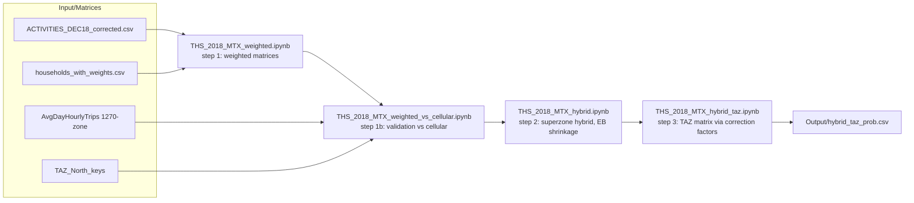

# Nofit LRT Extension — OD Demand Matrix

Builds an AM-peak (6:00–9:00) origin–destination demand matrix for the Nofit LRT
extension study area (778 TAZs, northern Israel) by fusing the 2018 Travel Habits
Survey with a cellular-derived OD matrix: cellular acts as the population-scale prior,
the survey as evidence, combined at the spatial scale where each is reliable.

See **[METHODOLOGY.md](METHODOLOGY.md)** for the full reasoning, methodology, inputs
and outputs of every step.

## Pipeline



## Notebooks

| Notebook | What it does |
|---|---|
| `THS_2018_MTX.ipynb` | Original analysis: unweighted survey matrices, first comparison against cellular |
| `THS_2018_MTX_weighted.ipynb` | Recreates the Day 10 / Day 20 matrices with household expansion weights (`wf_new`) — ~2.3M expanded trips per day |
| `THS_2018_MTX_weighted_vs_cellular.ipynb` | Validates the weighted matrices against cellular: superzone r ≈ 0.855; identifies the systematic intra-zone divergence (survey 72% vs cellular 34% self-containment) |
| `THS_2018_MTX_hybrid.ipynb` | Superzone hybrid via empirical-Bayes shrinkage, with the shrinkage constant chosen by cross-day validation |
| `THS_2018_MTX_hybrid_taz.ipynb` | Final 778-TAZ matrix: superzone correction factors R_AB applied to cellular OD cells, row-normalized |

## Key deliverables (`Output/`)

- `hybrid_taz_prob.csv` — final TAZ-level OD probability matrix (778×778)
- `hybrid_taz_prob_k100.csv` — variant with a stronger cellular floor on
  survey-unobserved OD pairs
- `hybrid_sz_prob.csv` / `hybrid_sz_trips.csv` — superzone hybrid (probabilities /
  average-weekday trips)
- Full inventory in [METHODOLOGY.md §7](METHODOLOGY.md#7-output-inventory-output)

## Setup

Input CSVs are stored in Git LFS:

```bash
git lfs pull
pip install pandas numpy matplotlib jupyter
```
