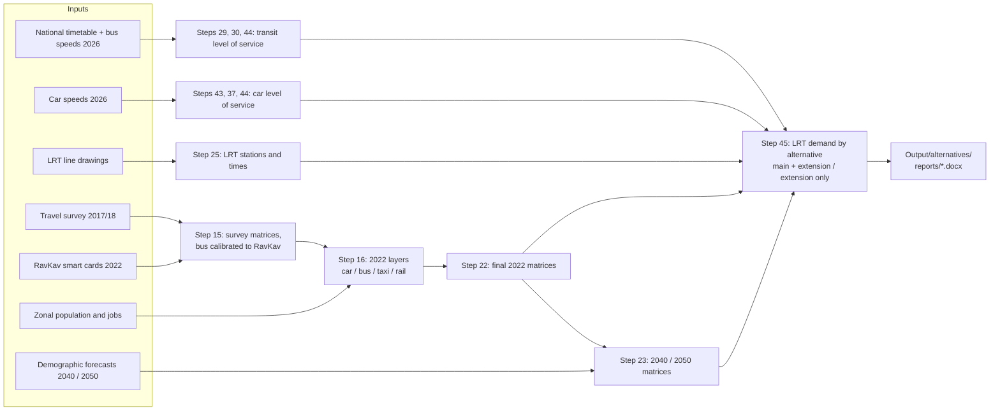

# Nofit LRT Extension — demand estimate

**Status: 6 October 2026.** This repository estimates how many people would ride the
planned **extension of the Nofit light rail (LRT)** in northern Israel. The main Nofit route
(Hamifrats – Nazareth, 40.7 km) is under construction. The extension continues it from
Hamifrats through Haifa to Tirat Carmel (18.9 km, 24 stations). Everything here is built in
Jupyter notebooks (Python) on committed inputs, so every number can be reproduced.

The full technical record is **[METHODOLOGY.md](METHODOLOGY.md)**. A plain-language
walk-through of every step is
**[docs/PLAIN_ENGLISH_METHODOLOGY.md](docs/PLAIN_ENGLISH_METHODOLOGY.md)**. The report for
decision-makers is
[`reports/Nofit_LRT_Extension_Comprehensive_Report.docx`](reports/Nofit_LRT_Extension_Comprehensive_Report.docx)
(Hebrew version alongside it).

---

## 1. The answer so far

All figures are **LRT trips in the morning peak, 06:00–09:00**, for the through line
(main route + extension) with the extension given priority at junctions. They are the
central case of step 45 ([METHODOLOGY §6aq](METHODOLOGY.md#6aq-step-45--demand-for-the-lrt-alternatives-main-route--extension-and-extension-only-two-regimes-2022--2040--2050--bu--hs-am-and-pm-at-taz-and-corridor-area-level-lrt_alternatives_demandipynb)).

| Scenario-year | LRT trips, three hours | Of which on the extension |
|---|---|---|
| 2022 (today's demand) | 5,193 | 4,004 (77 %) |
| 2040, business-as-usual (BU) | 6,309 | 4,950 |
| **2050, BU — the reference case** | **7,433** | **6,003 (81 %)** |
| 2040, high-growth scenario (HS) | 7,476 | 5,651 |
| 2050, HS | 9,225 | 7,010 |

What to read with these numbers:

- **Planning range for 2050 BU: 5,532 to 10,537.** The range comes from the one assumption
  that moves the result most, the cost sensitivity λ (see "What is still uncertain" below).
- **Extension only** (no through-running to Nazareth): 3,884 trips in 2022, 5,939 in 2050 BU.
  Through-running does not add extension riders; it spares them a transfer at Hamifrats.
- **Without priority at junctions** (slower running): roughly 20 % fewer trips.
- **The evening peak** (16:00–19:00) carries about 80 % of the morning figure.
- **Who rides:** today's bus and Metronit passengers moving to a faster vehicle. Only
  6–14 % of the LRT trips come out of cars; the transit market grows only by that car shift.
- **Where they ride (2050 BU):** Tirat Carmel ↔ Haifa 29 %, inside Haifa 22 %, the Krayot
  by feeder 22 %, main route ↔ Haifa 12 %; 38 % cross Hamifrats.
- **Peak hour:** the busiest hour holds about 55–60 % of the three hours in the survey, so
  the 2050 BU line carries roughly 4,400 trips in the peak hour, and the busiest segment
  carries about 1,000–1,400 across the forecast years. Road counts and smart-card data show
  a flatter peak (0.4–0.5), so the survey-based peak-hour values are an upper reading.

These are screening estimates for comparing alternatives and sizing the market. They are
not passenger loads for capacity design, and they are not externally validated forecasts.

---

## 2. What to trust: the current products

| Product | Where | What it is |
|---|---|---|
| **LRT demand by alternative** | `Output/alternatives/` | Trip matrices, line loads by segment and direction, station boardings for 2 alternatives × 2 regimes × 5 scenario-years × AM / PM; summary in `demand_summary.csv`, workbook `LRT_alternatives_matrices.xlsx` |
| **Base-year matrices, 2022** | `Output/final_2022/` | 778 × 778 zone matrices: `car`, `transit` (bus + rail), `total`; a long-format gzip file for SQL; a manifest |
| Base-year layers, 2022 | `Output/ths2017/three_mode_2022/` | The same demand as four layers: car, bus, taxi-type, rail; superzone and area versions |
| Forecast matrices, 2040 / 2050 | `Output/forecast_taz/{BU,HS}_{2040,2050}/` | The 2022 matrices grown by the demographic scenarios; mode split and trip rates held at 2022 |
| Level of service | `Output/los/`, `Output/skims/`, `Output/gc/` | Car and transit travel times, walks, waits and transfers between the 781 zones and between the 25 corridor areas |
| Corridor flows | `Output/corridor_v2/` | Potential movements between the 25 corridor areas along three routes, three-hour and peak-hour |
| LRT line and stations | `Output/lrt_v2/`, `Output/alternatives/stations_*.csv` | Station tables and station-to-station times for the extension and the main route |
| Validation | `Output/validation/`, `Output/validation_mot/`, `Output/ths2017/tests/` | Checks against road counts, smart cards, the phone-based matrix and the Ministry of Transport guideline |

Everything else under `Output/` is an input layer, a diagnostic, or historical. The
lineage table in [METHODOLOGY §0](METHODOLOGY.md#0-status-what-to-trust-and-how-to-read-this-document-6-october-2026)
says, for every file, what it was built from and whether it is current.

---

## 3. How the estimate is built, in plain words

The chain has six stages. Each stage is one or more notebooks (step numbers in brackets).

1. **Start from the household travel survey (2017/18).** Every trip a surveyed resident made
   between 06:00 and 09:00 is expanded by the household weight to represent the population.
   This gives a car matrix and a transit matrix between the 778 zones of the study area
   (steps 5, 15).

2. **Correct the bus matrix with smart-card data.** The survey's bus trips are calibrated
   against the May 2022 RavKav journeys, origin by origin: where the smart cards record at
   least half of the survey's trips, the smart-card volume is used; elsewhere the survey is
   kept (step 15). Everything is then grown to 2022 and split into car / bus / taxi-type /
   rail (step 16) and assembled into the deliverable matrices (step 22).

3. **Grow to 2040 and 2050.** The 2022 matrices are scaled to the population and employment
   forecasts of two demographic scenarios, BU and HS (step 23).

4. **Measure the level of service.** Car times come from the survey and from May 2026 car
   speeds (steps 26, 37, 43, 44). Bus and Metronit times come from the national timetable
   routed over measured May 2026 bus speeds (steps 29, 30, 44). LRT times come from the drawn
   line and a calibrated running-time function (step 25). Each mode gets a **generalized
   cost**: in-vehicle time + 2 × walk + 2 × wait + 8 minutes per transfer.

5. **Estimate how many trips move to the LRT.** For each zone pair, an incremental logit
   model starts from today's observed transit share and moves trips to the LRT according to
   how much cheaper the trip becomes in generalized cost. The cost sensitivity λ is 0.03 per
   generalized minute (assumed; a person-level estimate on the survey gives 0.035). Steps 31
   and 32 do this between the 25 corridor areas; step 45 does it zone by zone for the
   alternatives.

6. **Check the result against independent data.** The car layer against road counts, the bus
   layer against smart cards (2022 and 2025), the whole matrix against a phone-based matrix,
   and the Ministry of Transport's validation checklist (steps 12–14, 35, 36, 41, 42, and
   METHODOLOGY §6ar).


```mermaid
flowchart LR
    subgraph inputs [Inputs]
        THS[Travel survey 2017/18]
        RK[RavKav smart cards 2022]
        ZON[Zonal population and jobs]
        GTFS[National timetable + bus speeds 2026]
        CAR[Car speeds 2026]
        GEO[LRT line drawings]
        DEM[Demographic forecasts 2040 / 2050]
    end
    THS --> S15[Step 15: survey matrices,<br/>bus calibrated to RavKav]
    RK --> S15
    S15 --> S16[Step 16: 2022 layers<br/>car / bus / taxi / rail]
    ZON --> S16
    S16 --> S22[Step 22: final 2022 matrices]
    S22 --> S23[Step 23: 2040 / 2050 matrices]
    DEM --> S23
    GTFS --> LOS[Steps 29, 30, 44: transit level of service]
    CAR --> LOS2[Steps 43, 37, 44: car level of service]
    GEO --> S25[Step 25: LRT stations and times]
    LOS --> S45[Step 45: LRT demand by alternative<br/>main + extension / extension only]
    LOS2 --> S45
    S25 --> S45
    S22 --> S45
    S23 --> S45
    S45 --> OUT[Output/alternatives/<br/>reports/*.docx]
```

---

## 4. What is still uncertain

The main caveats, in order of how much they move the LRT number. The full list is
[METHODOLOGY §8](METHODOLOGY.md#8-known-caveats-and-open-questions) (29 items).

1. **The cost sensitivity λ.** It is assumed (0.03). The person-level estimate supports it
   (0.035) but cannot pin it down for people who own a car. Moving λ across 0.02–0.05
   changes the 2050 BU figure from 10,537 to 5,532.
2. **Walk and wait weights, transfer penalties, station access time.** A literature review
   found no confirmed values; across seven plausible parameter sets the area-level capture
   spans 1,456–4,935 trips (central 4,254).
3. **The LRT running regime.** Priority at junctions versus at-grade running is worth about
   20–25 % of the trips.
4. **The bus network after opening.** The model keeps every bus and Metronit line as it runs
   today. Removing the parallel trunk bus would raise the capture by 21–64 %.
5. **The peak-hour factor.** The survey's departure times give a sharper peak (0.55–0.65 of
   three hours) than road counts (0.38–0.43) and smart cards (0.43–0.48).
6. **The level of service is held at May 2026 in every forecast year.** A slower bus in
   2040 / 2050 would add 2–5 % to the LRT trips; a slower car cannot register in this model.
7. **The base matrices are residents' trips with both ends in the study area**, AM only.
   They hold 0.6–0.9 of the vehicles counted on road cordons (no trucks, visitors or through
   traffic) and reproduce the level, but not the link-by-link pattern, of the counts.
8. **The main route's operation is assumed** (80 km/h at grade, 5-minute headway, no
   transfer at Hamifrats); its 20 stations are the delivered list.

---

## 5. Repository layout

```
README.md                      this file
METHODOLOGY.md                 the full record: every step's purpose, method, inputs, results, outputs, caveats
docs/                          plans, the plain-English companion, the handover, the external review, the OVT research
notebooks/current/             the chain (one notebook per step) and its input notebooks; periods/ holds PM and midday copies
notebooks/diagnostics/         tests and validations: evidence, not products
notebooks/historical/          superseded work (the survey x cellular hybrids, the 25-area composite), kept as record
tools/                         Python scripts: report builders, map builders, the LFS pull helper, validation metrics
reports/                       the Word reports (English and Hebrew); reports/historical/ for superseded ones
Input/                         survey, smart cards, zonal files, timetables, speed networks, line drawings (large files in Git LFS)
Output/                        every product, committed as plain CSV / PNG / XLSX (no LFS)
```

Every notebook's first cell moves the working directory to the repository root, so all
`Input/…` and `Output/…` paths are root-relative and a notebook runs from anywhere inside
the repository.

---

## 6. Notebooks

Step numbers are the ones used throughout METHODOLOGY.md. "§" points to the section there.

### The current chain (`notebooks/current/`), in run order

| Step | Notebook | § | What it does |
|---|---|---|---|
| 8 | `BusRavKav_matrix.ipynb` | 6f | May 2022 RavKav records → average-Tuesday morning bus journey matrix by zone, boardings and alightings per zone |
| 10 | `Transit_complete_matrix.ipynb` | 6h | 2019 rail smart-card station-to-station matrix (the composite it also builds is historical) |
| 15 | `THS_2017_two_mode_matrix.ipynb` | 6m | Survey-only car and transit matrices; bus calibrated to RavKav per origin × segment |
| 16 | `THS_2017_three_mode_2022.ipynb` | 6n | Grows to 2022; splits into car / bus / taxi-type / rail layers |
| 17 | `Corridor_flow_profile_survey_2022.ipynb` | 6o | Potential movements along the line, link by link, three hours |
| 18 | `Corridor_profile_hybrid_vs_ticketing.ipynb` | 6p | The survey-based transit profile against the smart-card one |
| 20 | `Corridor_peak_hour_2022.ipynb` | 6r | Peak hour and peak-hour factors from the survey's departure times |
| 22 | `Final_matrices_2022.ipynb` | 6t | Assembles the deliverable car / transit / total matrices for 2022 |
| 23 | `Forecast_matrices_TAZ_2040_2050.ipynb` | 6u | Grows the 2022 matrices to BU / HS × 2040 / 2050 |
| 27 | `Corridor_peak_hour_V2_routes.ipynb` | 6y | Peak-hour factors per route and direction on the 25-area V2 aggregation (runs before 24) |
| 24 | `Corridor_flow_profile_V2_routes.ipynb` | 6v | Potential movements on the V2 aggregation: three routes and a tree network |
| 28 | `Corridor_profile_V2_survey_vs_ticketing.ipynb` | 6z | Survey vs smart-card transit profiles on the V2 routes |
| 25 | `LRT_line_stations_travel_time.ipynb` | 6w | The drawn extension → 24 stations and station-to-station times (several running regimes) |
| 29 | `GTFS_bus_LOS_TAZ.ipynb` | 6aa | Bus and Metronit level of service per zone from the national timetable; timetable skim between areas |
| 30 | `GTFS_bus_observed_times.ipynb` | 6ab | Timetable trips routed over measured May 2026 bus speeds → observed in-vehicle times |
| 26 | `GC_data_inventory_and_skims.ipynb` | 6x | Generalized-cost components per mode between the 25 areas, with a gap inventory (runs after 29, 30) |
| 31 | `Mode_skims_and_flow_comparison.ipynb` | 6ac | Complete skims per mode; the pivoted LRT capture model between the 25 areas (central 4,250 trips) |
| 32 | `LRT_capture_forecast_2040_2050.ipynb` | 6ad | The same capture on the 2040 / 2050 sets |
| 33 | `Mode_choice_person_level.ipynb` | 6ae | Person-level logit on the survey: estimates λ (0.035) with car availability held constant |
| 34 | `RavKav_2025_boardings_matrix.ipynb` | 6af | The 2025 smart-card extracts → boardings by stop and zone, bus + Metronit OD, rail OD, peak factors |
| 43 | `Car_speed_network_North.ipynb` | 6am | May 2026 car speed network clipped to the study area |
| 37 | `Car_skim_2026_network.ipynb` | 6an | Car times between the 25 areas at 2026 speeds, against the survey's times |
| 44 | `LOS_skims_TAZ_and_V2.ipynb` | 6ao | Car and transit level of service for every zone pair (781 zones), aggregated to the 25 areas |
| 39 | `LRT_capture_TAZ.ipynb` | 6ap | The capture run zone by zone (diagnostic; not adopted) |
| 40 | `LRT_capture_uncertainty.ipynb` | 6ak | Which assumptions move the capture most (factorial and tornado) |
| 45 | `LRT_alternatives_demand.ipynb` | 6aq | **The deliverable:** LRT demand for main + extension vs extension only, two regimes, 2022–2050, AM and PM |
| — | `BusOnBoard_matrix.ipynb` | 6g | RavKav volumes × on-board survey destinations; comparison only since 23 Sep 2026 |
| — | `BusRavKav_matrix_periods.ipynb` | 6ar | Step 8 for the PM-peak and midday windows |
| 5, 7 | `THS_2017_trips_matrices.ipynb`, `THS_2017_trip_generation.ipynb` | 6c, 6e | The survey trips file extracted by day and mode; trips per resident (≈ 0.83 in the morning peak) |
| — | `Demographic_scenario_comparison.ipynb` | — | BU vs HS forecasts compared by area |

### Diagnostics and validation (`notebooks/diagnostics/`)

| Step | Notebook | § | What it does |
|---|---|---|---|
| 12–14 | `THS_2017_cosine_GEH_tests`, `THS_2017_KS_tests`, `THS_2017_MSSIM_tests` | 6j–6l | Similarity tests of survey vs phone-based vs hybrid matrices |
| 19 | `Hybrid_superzone_conservation_test` | 6q | Shows the historical hybrid does not conserve its superzone blocks; rebalances it |
| 21 | `THS_2017_PCA_car_vs_transit` | 6s | Car and transit destination structure compared (PCA) |
| 35 | `THS_vs_RavKav_2025_tests` | 6ag | The similarity tests on today's products; shows the survey matches RavKav's own alightings |
| 36 | `Car_cordon_counts_validation` | 6ah | The car layer against road counts on six closed cordons |
| 41 | `RavKav_2025_own_alightings` | 6ai | Chains the 2025 taps into journeys; checks the transfer tag |
| 42 | `Car_AON_assignment_2022` | 6aj | All-or-nothing assignment of the car layer onto the road network |
| — | `MOT_Validation_Stage*` (six notebooks + PM / midday copies), `Bus_destination_pattern_RavKav_vs_OnBoard` | 6ar | The Ministry of Transport validation guideline, waves 1, 1b, 2, 3 |
| — | `THS_2018_MTX_weighted_vs_cellular`, `*_PCA_vs_cellular`, `THS_PCA_*`, `Cellular_eigenplaces_TAZ` | 4, 8b | The survey vs phone-data comparisons of the first generation |

### Historical (`notebooks/historical/`), superseded and kept as record

Steps 1–4 (`THS_2018_MTX*`: the 2018 activities-file chain and the survey × cellular
hybrids), step 6 (`THS_2017_hybrid_pipeline`), step 11 (`Vintage_alignment_2022`) and the
old 25-area forecast branch (`Forecast_matrices_2040_2050`, `Base_mode_shares_2022`,
`NoBuild_and_LRT_market`, `LRT_alignment_markets`). Nothing current reads them.

---

## 7. Reports

| Report | Date | What it is for |
|---|---|---|
| [`reports/Nofit_LRT_Extension_Comprehensive_Report.docx`](reports/Nofit_LRT_Extension_Comprehensive_Report.docx) | 5 Oct 2026 | **The report for decision-makers:** one-page decision summary, goal, model and data, calibration and base year with every caveat, results for 2040 / 2050 × BU / HS, markets, the Metronit, conclusions. Built by `tools/build_comprehensive_report.py` |
| [`reports/Nofit_LRT_Extension_Comprehensive_Report_HE.docx`](reports/Nofit_LRT_Extension_Comprehensive_Report_HE.docx) | 5 Oct 2026 | The same report in simple Hebrew, shorter, same numbers and charts |
| [`reports/LRT_Alternatives_Demand_Report.docx`](reports/LRT_Alternatives_Demand_Report.docx) | 5 Oct 2026 | The alternatives in detail: times on route, demand tables AM / PM, 41 maps of time, demand, line loads, growth and shift to the LRT |
| [`reports/Survey_Matrices_Car_Bus_Rail_Report.docx`](reports/Survey_Matrices_Car_Bus_Rail_Report.docx) (+ `_HE`) | 4 Oct 2026, rev. 3.0 | The base-year matrices in plain language: sources, calibration, tests against smart cards, road counts and the phone-based matrix, fitness for use |
| [`reports/V2_Corridor_LRT_Times_and_GC_Inputs_Report.docx`](reports/V2_Corridor_LRT_Times_and_GC_Inputs_Report.docx) | 22 Sep 2026, rev. 1.4 | The corridor on the 25-area aggregation, the LRT times, the generalized-cost inputs; a dated revision note carries the later values |
| [`reports/Matrices_Growth_and_Missing_Data_Plain_Hebrew_Report.docx`](reports/Matrices_Growth_and_Missing_Data_Plain_Hebrew_Report.docx) | 4 Oct 2026 | Hebrew plain-language note on the matrices, the forecasts and the missing data |
| `reports/historical/` | Sep 2026 | The first OD report, the demographic scenario comparison and the PCA reports, each with a status note |

Charts and maps: `Output/figures/comprehensive/` (one chart per file, one axis scale per set
of scenario-years), `Output/figures/alternatives/` (maps, with `single/` and `_zoom` twins
framed on the extension). Every chart and map shows the **peak hour**; the tables keep the
three-hour totals beside it.

---

## 8. Documents in `docs/`

- [`PLAIN_ENGLISH_METHODOLOGY.md`](docs/PLAIN_ENGLISH_METHODOLOGY.md) — every step explained in plain language, with an update chapter for the September–October work
- [`NEXT_STEPS_HANDOVER_2026-09-23.md`](docs/NEXT_STEPS_HANDOVER_2026-09-23.md) — how the repository is worked, where it stands, and the next steps specified for hand-over (inputs, method, outputs, checks)
- [`CORRIDOR_DEMAND_TASKS.md`](docs/CORRIDOR_DEMAND_TASKS.md) — the open task list
- [`MOT_VALIDATION_PLAN.md`](docs/MOT_VALIDATION_PLAN.md) — the validation plan under the Ministry of Transport guideline and its status
- [`OVT_WEIGHTS_RESEARCH_PLAN.md`](docs/OVT_WEIGHTS_RESEARCH_PLAN.md), [`OVT_WEIGHTS_PARAMETER_MEMO.md`](docs/OVT_WEIGHTS_PARAMETER_MEMO.md), [`OVT_REPORTS_COMPARISON_2026-10-04.md`](docs/OVT_REPORTS_COMPARISON_2026-10-04.md) — the research on walk / wait weights and transfer penalties
- [`LRT_CAPTURE_PLAN.md`](docs/LRT_CAPTURE_PLAN.md) — the generalized-cost capture model as planned
- [`PLAN_TIGHTENING_AND_SCENARIOS.md`](docs/PLAN_TIGHTENING_AND_SCENARIOS.md) — what moves the capture number and the scenarios to run
- [`FORECAST_METHODOLOGY_2040_2050.md`](docs/FORECAST_METHODOLOGY_2040_2050.md) — how the 2022 matrices are grown to 2040 / 2050
- [`Nofit_Demand_Methodology_Review.md`](docs/Nofit_Demand_Methodology_Review.md) and [`RED_TEAM_RESPONSE_2026-09-23.md`](docs/RED_TEAM_RESPONSE_2026-09-23.md) — the external review of 21 September 2026 and the response to it
- [`Transit_Travel_Time_Calibration_Report_Operator22.md`](docs/Transit_Travel_Time_Calibration_Report_Operator22.md) — the calibrated LRT running-time function
- [`TRANSIT_DEMAND_PLAN.md`](docs/TRANSIT_DEMAND_PLAN.md) — the (historical) ticketing-substitution decision

---

## 9. Setup and how to run

Every file directly under `Input/` is stored in Git LFS, as are the large archives. Pull the
small inputs before any notebook runs. Without the git-lfs client, `tools/lfs_pull.py` fetches
individual files.

```bash
pip install pandas numpy scipy matplotlib jupyter openpyxl pyshp shapely pyproj geopandas pyogrio statsmodels python-docx
git lfs pull --include="Input/*.xlsx,Input/*.csv"                        # required (≈ 22 MB)
git lfs pull --include="Input/THS_2017-2018/*"                           # the survey (≈ 58 MB): steps 15, 33, the validation
git lfs pull --include="Input/Demographic_Forecast/Zonal_*.csv"          # step 23
git lfs pull --include="Input/GTFS/israel-public-transportation.zip"     # steps 29, 45 (181 MB)
git lfs pull --include="Input/BusSpeedData/std_202605.csv"               # steps 26, 30 (311 MB)
git lfs pull --include="Input/Network_with_Counts/*"                     # steps 36, 42 (74 MB)
git lfs pull --include="Input/BusRavKav/2025/*,Input/BusRavKav/Stops_In_North/*"   # step 34 (≈ 3.3 GB)
git lfs pull                                                             # everything else: cellular, RavKav 2022, train
```

Run order of the chain (all under `notebooks/current/`, each with
`jupyter nbconvert --to notebook --execute --inplace <notebook>`):

1. Base year: `THS_2017_two_mode_matrix` → `THS_2017_three_mode_2022` → `Corridor_flow_profile_survey_2022` → `Corridor_profile_hybrid_vs_ticketing` → `Corridor_peak_hour_2022` → `Final_matrices_2022` → `Forecast_matrices_TAZ_2040_2050`
2. Corridor and LRT line: `Corridor_peak_hour_V2_routes` → `Corridor_flow_profile_V2_routes` → `Corridor_profile_V2_survey_vs_ticketing` → `LRT_line_stations_travel_time`
3. Level of service: `GTFS_bus_LOS_TAZ` → `GTFS_bus_observed_times` → `GC_data_inventory_and_skims` → `Car_speed_network_North` → `Car_skim_2026_network` → `LOS_skims_TAZ_and_V2`
4. LRT demand: `Mode_skims_and_flow_comparison` → `LRT_capture_forecast_2040_2050` → `Mode_choice_person_level` → `LRT_capture_TAZ` → `LRT_capture_uncertainty` → `LRT_alternatives_demand`
5. Reports: `python3 tools/build_alternatives_maps.py`, `tools/build_alternatives_report.py`, `tools/peak_hour_factors_periods.py`, `tools/build_comprehensive_report.py`, `tools/build_comprehensive_report_he.py`

The exact commands, the environment variables that select alternative runs (`NOFIT_PERIOD`,
`CAR_SOURCE`, `BUS_WAIT_RULE`, `LRT_HEADWAY`, `BUS_COMPETITION`, `BUS_SLOWDOWN`, `OVT_TAG`)
and the run times are in [METHODOLOGY §9](METHODOLOGY.md#9-reproduction).

---

## 10. How the work got here (short history)

- **Up to 8 Sep 2026.** First generation: survey matrices blended with a phone-based
  (cellular) matrix; bus and rail inputs from smart cards; a 25-area composite and a first
  forecast; similarity tests (steps 1–14).
- **21 Sep.** External review. The tests and the review moved the base to **survey only**
  with the bus calibrated to smart cards (steps 15–22); the old hybrids became historical.
- **22 Sep.** The 25-area V2 corridor aggregation, the LRT line and its stations, the
  generalized-cost inventory, the timetable and bus-speed level of service, the first
  capture model, and the 2040 / 2050 matrices (steps 23–32).
- **23 Sep.** Person-level λ (step 33) found the survey's mode codes for Metronit and group
  taxi swapped; steps 15–32 rerun. The 2025 smart cards (step 34) and the rerun tests
  (step 35) showed the survey matches RavKav's own alightings, so the bus calibration was
  **rebuilt on them** and steps 16–35 rerun. Car layer checked against road counts (step 36).
  Sensitivities on bus wait, LRT regime and headway, bus competition, synthetic branches,
  design-hour factors; steps 40–42; the handover document.
- **4 Oct.** Survey report revision 3.0 and its Hebrew version; the Ministry of Transport
  validation in four waves, including PM and midday matrices; the research on out-of-vehicle
  weights and the chain rerun on seven parameter sets.
- **5 Oct.** May 2026 car speeds (steps 43, 37), level of service zone by zone (step 44),
  the capture zone by zone (step 39), the main route delivered and **the LRT alternatives
  (step 45)**, the comprehensive report in English and Hebrew with charts and maps at the
  peak hour, and the decision summary.

The dated detail of every change, with the before and after values, is in
[METHODOLOGY §0](METHODOLOGY.md#0-status-what-to-trust-and-how-to-read-this-document-6-october-2026).
