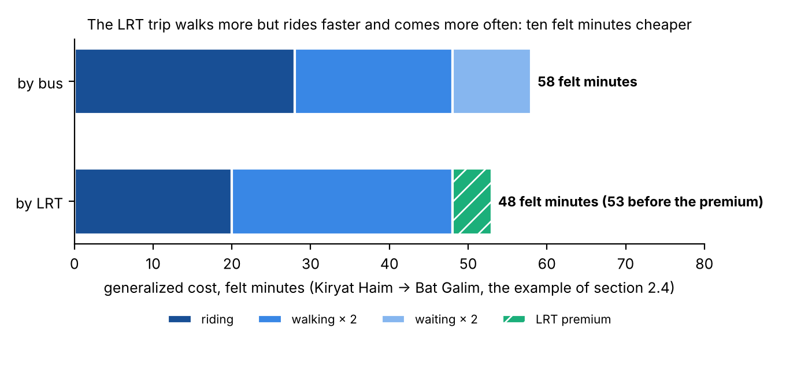

# Appendix D. The generalized cost function (ASD-STE100 version)

*This document is a second version of Appendix D of the comprehensive report (`reports/Nofit_LRT_Extension_Comprehensive_Report.docx`, built by `tools/report_appendices.py`). It is written to the rules of ASD-STE100 Simplified Technical English: sentences of 25 words or fewer, one topic per paragraph, paragraphs of 6 sentences or fewer, active voice, simple present tense, approved words with one meaning each, one technical name per item, vertical lists for sequences, and "must" for a requirement. All numbers are the same as in the report version. The technical names used in this appendix are given in the list below.*

## Technical names used in this appendix

| Technical name | Meaning |
|---|---|
| Generalized cost (GC) | One value, in felt minutes, that shows the total effort of a trip |
| Felt minute | A minute of trip time after the model applies the factors of Table D.1 |
| Traveller | A person who makes a trip |
| Pair | One origin zone and one destination zone |
| Path | The sequence of walks, waits and vehicles between the two zones of a pair |
| In-vehicle time | The time a traveller is in a vehicle |
| Walk time | The time a traveller walks at the start of the trip, at the end of the trip, and between two vehicles |
| Wait time | The time a traveller waits at a stop or at a station |
| Transfer | A change from one vehicle to a different vehicle. The first vehicle of a trip is not a transfer |
| Transfer penalty | A fixed value that the model adds for each transfer |
| Station access time | The time from the entrance of an LRT station to the platform |
| LRT premium | A fixed value that the model subtracts from the cost of an LRT path |
| Split | The percentage of the trips of a pair by car and the percentage by transit |
| Capture | The number of LRT trips that the model calculates |
| LRT | Light rail transit |
| Metronit | The bus rapid transit system of the Haifa area |

## What this appendix answers

This appendix answers four questions:

- Why does the model change each trip into one value?
- What is in that value?
- Where does each item of that value come from?
- Which decisions and corrections changed the formula between September 2026 and the formula of the report?

## D.1 Why the model uses one value

The model must compare trips that are different in each part. One trip has more walk time. A different trip has less wait time. A third trip has a transfer. A fourth trip is faster, but the stop is far from the home. The model cannot compare these trips directly.

The generalized cost puts all these trips on one scale. The unit of the scale is the felt minute. The model counts the time outside the vehicle more than one time (Appendix B). The model adds a fixed value for each transfer. The model subtracts a fixed value for an LRT path, because travellers select a rail vehicle more often than a bus at an equal time.

**The formula of the reference case:**

> **GC = in-vehicle time + 2 × walk time + 2 × wait time + transfer penalty + station access time − LRT premium**

where:

- transfer penalty = 8 minutes for each transfer, or 4 minutes for a transfer between the Metronit and the LRT
- station access time = 0.5 minutes for each end of the LRT part of the path
- LRT premium = 5 minutes when the model compares the LRT path with a bus path, or 2.5 minutes when the model compares the LRT path with a Metronit path.

**Table D.1 — The items of the generalized cost in the reference case**

| Item | Where the item comes from | Factor or value |
|---|---|---|
| In-vehicle time, bus and Metronit | The timetable of May 2026, with the speeds measured on the street network in May 2026. In the peak hour, the buses are 1.09 times slower than the timetable. | Factor 1 |
| In-vehicle time, train | The timetable | Factor 1 |
| In-vehicle time, LRT | The calibrated function of Appendix A | Factor 1 |
| In-vehicle time, car | The speeds measured on the network in May 2026, between the centroids of the zones. Plus 3 minutes for the parking and for the walks at the two ends. | Factor 1 |
| Walk time | The straight-line distance × 1.3, at 4 km/h. The model includes the stops within 1 km of the zone. For a transfer, the model includes the stops within 300 m of the first stop. | Factor 2 |
| Wait time | Half of the combined headway of all the lines that serve the pair in the peak hour, with a maximum of 10 minutes. LRT: 2.5 minutes, because a tram comes each 5 minutes. | Factor 2 |
| Transfer penalty | A fixed value for the effort of a change of vehicle and for the risk of a missed connection. The model adds this value to the walk time and the wait time of the transfer. | 8 minutes; 4 minutes between the Metronit and the LRT |
| Station access time | The time from the entrance of the station to the platform | 0.5 minutes for each LRT end |
| LRT premium | The value of a rail vehicle at an equal time, from the in-vehicle factors of calibrated models | −5 minutes against a bus path; −2.5 minutes against a Metronit path |
| Money | Fare, parking, fuel | Not included, by decision (D.2, step 2) |

## D.2 The steps from the first formula to the formula of the report

We changed the formula in 7 steps between 22 September 2026 and October 2026. We then did 4 checks on the full chain of the model.

### Step 1. The first formula (LRT capture plan, 22 September 2026)

The first formula was:

> GC = in-vehicle time + 2 × walk time + 2 × wait time + 8 minutes for each transfer + (fare + parking) ÷ value of time

The value of time was 30 ILS per hour, as a temporary value. The factors 2, 2 and 8 are in the middle of the ranges of standard practice. The usual ranges are 1.5 to 2.5 for walk time and for wait time, and 5 to 10 minutes for a transfer.

### Step 2. We removed the money terms (22 September 2026)

The transit fare in the area is one flat fare for all the modes. A daily maximum makes the transfers and the return trips free. Thus the fare is the same for each bus trip, Metronit trip and LRT trip, and for each pair. The fare cannot change the selection between these modes.

Against the car, the fare is a constant for each trip. The model starts from the car-versus-transit split measured in 2022. The model does not calculate this split from the costs (Appendix C.4). Thus a constant cost for each trip has no effect on the result.

We also removed the parking cost and the fuel cost, by the same decision. There are no parking data for the area. From this step, the cost is in minutes only.

### Step 3. We replaced the temporary values with measured data (22 and 23 September 2026)

The first calculation used a walk time of 8 minutes and a headway of 10 minutes for each bus pair. We replaced these values in three stages:

1. The national timetable: the walk time to the actual stops, and the wait time from the actual headways.
2. The in-vehicle times measured on the street network in May 2026. On the arterial roads with the most demand, these times are 1.1 to 1.4 times the timetable.
3. The Metronit as a mode of its own.

We corrected the LRT in-vehicle time for the distance between the stations (Appendix A). We set the LRT headway to 5 minutes.

We compared the bus times with the times that the travellers gave in the survey. The door-to-door times from the survey are 7 to 9 minutes more than the times from the timetable. This difference comes from the transfer, from the wait for the correct line, and from delays. The transfer penalty and the wait time are the terms that show this difference.

### Step 4. We added the LRT premium (22 September 2026) and the Metronit premium (5 October 2026)

Travellers select a rail vehicle more often than a bus at an equal time. Calibrated models show this as an in-vehicle factor of 0.80 to 0.85 for an LRT. The factor for a bus rapid transit is 0.90 to 0.95. On the 14 minutes of in-vehicle time of the trunk, this difference is approximately 5 minutes against a bus path. The difference is approximately 2.5 minutes against a Metronit path.

### Step 5. We set the transfer penalties (22 September and 5 October 2026)

A transfer between a bus and the LRT costs 8 minutes. The first version set the transfer between the Metronit and the LRT to 0 minutes. That version used an integrated interchange on the same platform. The out-of-vehicle time research of Appendix B found no study with a value of less than 4 minutes, also for a cross-platform transfer. Thus we set this transfer to 4 minutes.

### Step 6. We added the station access time and changed the walk speed (5 October 2026)

We added 0.5 minutes for each end of the LRT part of the path. This is the time from the entrance of the station to the platform. We changed the walk speed from 4.8 km/h, the usual Israeli value, to 4 km/h. The same research gives both values.

### Step 7. We changed from areas to zones (steps 44 and 45, October 2026)

The first calculations used 25 corridor areas. A cost at the area level puts together the headways of all the lines of the area. It also uses the walk to the nearest stop of the area. No single traveller gets this combination. Thus the area-level cost of the bus on the trunk was too low by approximately one third. The area-level cost was 30 felt minutes, against 45 felt minutes at the zone level.

The reference case calculates the cost for each pair of zones on the line graph of the timetable. The traveller boards the LRT at the station with the lowest access cost at each end.

### The checks

We did these checks on the full chain of the model:

- We did the calculation again with 9 sets of out-of-vehicle parameters (Appendix B).
- We tested the bus wait time with the headway of the line with the most frequent service, in place of the combined headway. The bus cost increased by 14 %. The LRT capture increased by 15 %.
- We compared the car times with the door-to-door times of the survey. The car times are 0.90 to 0.95 of the survey times. Thus we did not increase the car times.
- We calculated the capture on the car network of 2026, and with slower buses in 2050 (section 4.9).

## D.3 Two examples

### Example 1: Kiryat Haim to Bat Galim

The trip by bus:

- Walk 6 minutes to the stop.
- Wait 5 minutes (a bus each 10 minutes).
- 28 minutes in the vehicle.
- Walk 4 minutes at the end.

> GC = 28 + 2 × (6 + 4) + 2 × 5 = **58 felt minutes**

The same trip by LRT:

- Walk 9 minutes to the station.
- Wait 2.5 minutes.
- 20 minutes in the vehicle.
- Walk 5 minutes at the end.

> GC = 20 + 2 × (9 + 5) + 2 × 2.5 = 53 felt minutes
>
> Subtract the LRT premium of 5 minutes: **48 felt minutes**

The LRT trip has more walk time. But the LRT trip has a cost that is 10 felt minutes lower, because the LRT is faster and comes more often. With λ_T = 0.06, this difference gives the LRT 65 % of the transit travellers of the pair (Appendix C).

*Figure D.1 — Example 1 in felt minutes: in-vehicle time, walk time and wait time (each with a factor of 2), and the LRT premium. No trip in this example has a transfer.*

### Example 2: the Krayot to Bat Galim, with the Metronit terms

Today, this trip uses the Metronit for the full distance:

- Walk 5 minutes.
- Wait 3 minutes.
- 35 minutes in the vehicle.

> GC = 35 + 2 × 5 + 2 × 3 = **51 felt minutes**

The LRT path for the same trip:

- Metronit to Hamifrats: walk 5 minutes, wait 3 minutes, 18 minutes in the vehicle.
- Transfer at Hamifrats: transfer penalty 4 minutes, wait 2.5 minutes, station access time 0.5 minutes.
- LRT to Bat Galim: 12 minutes in the vehicle, station access time 0.5 minutes at the exit.
- Walk 5 minutes at the end.
- LRT premium against a Metronit path: −2.5 minutes.

> GC = 18 + 12 + 2 × (5 + 5) + 2 × (3 + 2.5) + 4 + 0.5 + 0.5 − 2.5 = **63.5 felt minutes**

The LRT path has a cost that is 12.5 felt minutes higher. The LRT path gets 32 % of the transit travellers of the pair (the curve of Table C.1).

Before 5 October, the model used a transfer penalty of 0 minutes and a station access time of 0 minutes for this transfer. With those values, the difference decreases to 7.5 felt minutes, and the LRT percentage increases to 39 %. Thus these two terms, and not the speed of the LRT, control the result for the Krayot market.

## D.4 What the function does not include

- The factors come from published studies and from other calibrated models. The factors are not calibrated on this corridor. We did the calculation again with 9 sets of factors to show the range that the factors open (Appendix B).
- The function has no money terms. Thus the function cannot test a fare policy or a parking policy that gives different costs to different modes.
- The function has no terms for crowding, reliability or comfort, except the LRT premium. The walk times have no term for slopes, in a city where slopes are important. The function makes no difference between a stop with a shelter and a stop without a shelter.
- The absolute cost of the car has no effect on the result. The model starts from the split measured in 2022. Thus a slower car in 2050 changes nothing (caveat 25). Only the transit side of the cost changes the results.
- The walk times are averages for each zone, weighted by population and by employment. They are not walk times for each address. The station access time is one value for each end.

*Sources: docs/LRT_CAPTURE_PLAN.md; METHODOLOGY.md §6x (step 26 and its seven addenda), §6ac (step 31), §6ao (step 44), §6al, §6aq (step 45); Output/alternatives/skims_summary.csv; section 2.4 of the comprehensive report.*
