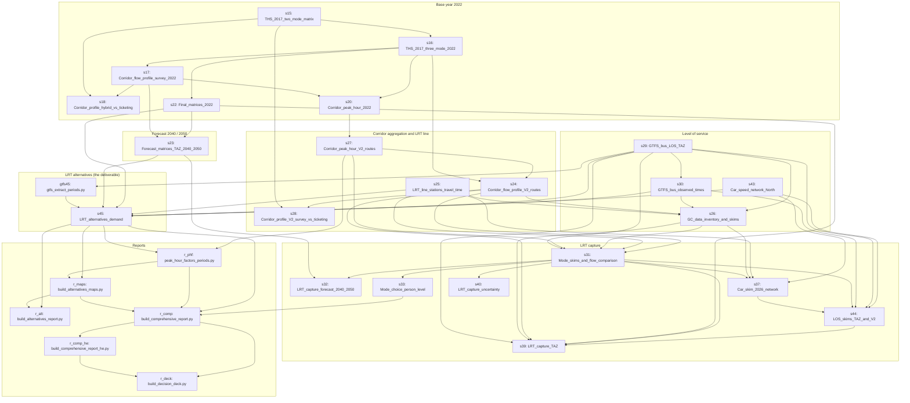

# The pipeline, start to finish

> Generated from `pipeline/steps.py` by `python3 -m pipeline doc`. Edit the manifest, not this file.

The demand estimate for the Nofit LRT extension is a chain of Jupyter notebooks and Python scripts. Each
one reads committed inputs under `Input/` and the outputs of earlier steps under `Output/`, and writes its
own outputs back under `Output/` (or `reports/`). This document lists the whole chain in one place, in run
order, with what every step needs and produces. The methods and results are in
[METHODOLOGY.md](../METHODOLOGY.md); the step numbers and section references below are its.

## How to run it

```bash
pip install pandas numpy scipy matplotlib openpyxl pyshp shapely pyproj geopandas pyogrio statsmodels python-docx nbformat nbclient ipykernel
python3 -m pipeline check                      # which inputs are still LFS pointers, which packages are missing
python3 -m pipeline check --stage base_year    # the same for one stage
python3 -m pipeline run --dry-run              # the plan: every default step, in order, with its environment
python3 -m pipeline run                        # the default chain, base year to reports (about 56 minutes plus the GTFS and smart-card steps)
python3 -m pipeline run --stage los capture    # two stages
python3 -m pipeline run --from s31 --to s45    # a slice of the run order
python3 -m pipeline run --only s31 --env LRT_HEADWAY=7.5   # one notebook with another setting (executed copy in place: use a v* step for a scratch copy)
python3 -m pipeline run --only v26_h75 v31_h75  # the committed sensitivity run of that setting (executed copies go to pipeline/logs/executed/)
python3 -m pipeline run --skip-done            # skip every step whose listed outputs already exist
python3 -m pipeline run --with-optional --stage validation   # the Ministry of Transport validation
python3 -m pipeline list --all -v              # every step with its title, note and environment
python3 -m pipeline graph --all                # the dependency graph (Mermaid)
```

Every run appends `=== START / OK / FAILED <id>` lines to `pipeline/logs/run_<timestamp>.log` and one row
per step to the CSV beside it. Executed notebooks replace the committed ones (the repository convention:
executed notebooks are committed), except the alternative runs (`v*` steps), whose executed copies go to
the scratch folder so the committed default run stays intact, and the PM / midday runs, which go to the
`periods/` copies. A failure stops the run unless `--keep-going` is given; the notebook as far as it got
is written out for diagnosis.

Before a step runs, its inputs are checked: a file still in Git LFS pointer form stops the run with the
`git lfs pull --include=...` (or `python3 tools/lfs_pull.py ...`) command that fetches it. `--skip-done`
skips a step whose listed outputs all exist, so a partial rerun needs no bookkeeping. Step ids that are
only *needed* by the selection (`--with-deps`) are skipped in the same way.

**Default chain and optional steps.** The default run (no `--with-optional`) covers the base year, the
forecast, the corridor and LRT line, the level of service, the capture, the alternatives and the reports:
everything that produces a product the reports quote. The optional steps are the upstream rebuilds of
committed products from the raw smart-card files (gigabytes on LFS), the PM / midday matrices, the
sensitivities, and the validation. The dependency graph records them all; `--with-deps` pulls a needed
optional step in and skips it when its committed outputs are present.

## The stages

| # | Stage | Steps | What it does |
|---|---|---|---|
| 1 | **Upstream inputs from raw records** (`upstream`) | 7 (7 optional) | Smart-card and survey files turned into the matrices the chain starts from. Heavy LFS inputs; outputs committed, rerun only when the raw files change. |
| 2 | **Base year 2022** (`base_year`) | 6 | Survey matrices (car, transit) with the bus calibrated to RavKav; grown to 2022 and split into car / bus / taxi-type / rail; corridor profiles and peak hour; the deliverable 2022 matrices. |
| 3 | **PM and midday base matrices** (`periods`) | 4 (4 optional) | Steps 15 and 16 run on the 16:00–19:00 and 09:00–15:00 windows (NOFIT_PERIOD); the PM layers feed the PM runs of the alternatives. |
| 4 | **Forecast 2040 / 2050** (`forecast`) | 2 (1 optional) | The 2022 matrices grown to the BU and HS demographic scenarios. |
| 5 | **Corridor aggregation and LRT line** (`corridor_lrt`) | 4 | The 25-area V2 aggregation, peak-hour factors per route, survey vs smart-card profiles, the drawn extension turned into stations and running times. |
| 6 | **Level of service** (`los`) | 4 | Bus and Metronit times from the national timetable routed over measured bus speeds; the generalized-cost inventory between the 25 areas; the May 2026 car speed network. |
| 7 | **LRT capture** (`capture`) | 7 | The incremental logit between the 25 areas and its forecast; the person-level λ; car and transit level of service zone by zone; the capture zone by zone; the uncertainty analysis. |
| 8 | **LRT alternatives (the deliverable)** (`alternatives`) | 2 | Demand for main route + extension vs extension only, two running regimes, 2022–2050, AM and PM, zone by zone. |
| 9 | **Reports** (`reports`) | 6 | Peak-hour factors for the charts, maps, the alternatives report, the comprehensive report in English and Hebrew, the decision deck. |
| 10 | **Sensitivities and alternative runs** (`sensitivity`) | 17 (17 optional) | The same notebooks with other settings: 2026 car skim, LRT headway, bus competition, bus wait rule, out-of-vehicle weights, slower buses, TAZ bus construction. Executed copies go to the scratch folder. |
| 11 | **Validation and diagnostics** (`validation`) | 30 (30 optional) | Tests against smart cards, road counts, the phone-based matrix and the Ministry of Transport guideline. Evidence, not products. |



Arrows read "is read by": a step comes after everything it needs. Optional steps are shown with
`python3 -m pipeline graph --all`.

## The steps, in run order

### 1. Upstream inputs from raw records

Smart-card and survey files turned into the matrices the chain starts from. Heavy LFS inputs; outputs committed, rerun only when the raw files change.

| id | Step | § | Notebook / script | Needs | Inputs | Key outputs | Minutes |
|---|---|---|---|---|---|---|---|
| `s05` | 5 | 6c | `notebooks/current/THS_2017_trips_matrices.ipynb`<br>*optional* | — | `trips_ths_2017.xlsx`, `1270_02_09_2021_TAZ_North_keys.csv`, `TAZ_2636_Keys.xlsx`, `TAZ_GSnew.csv`, (`AvgDayHourlyTrips201819_1270_weekday_v1.csv`) | `Output/ths2017/matrix_avg_ALL.csv`, `Output/ths2017/study_taz/matrix_avg_ALL_taz.csv` | 3 |
| | | | *Survey trips file extracted by day and mode (area matrices, study-area zone matrices)* First-generation product; the chain reads the study-area legend it left under Output/ths2017/study_taz/. | | | | |
| `s07` | 7 | 6e | `notebooks/current/THS_2017_trip_generation.ipynb`<br>*optional* | — | `trips_ths_2017.xlsx`, `1270_02_09_2021_TAZ_North_keys.csv`, `TAZ_2636_Keys.xlsx`, `TAZ_GSnew.csv` | `Output/ths2017/trip_generation_summary.csv` | 1 |
| | | | *Trips per resident in the morning peak (≈ 0.83)* | | | | |
| `s08` | 8 | 6f | `notebooks/current/BusRavKav_matrix.ipynb`<br>*optional* | — | `trips_table_2022-05-03.csv`, `trips_table_2022-05-17.csv`, `trips_table_2022-05-24.csv`, `trips_table_2022-05-31.csv`, `TAZ_North.shp` | `Output/bus/bus_od_taz_avg.csv`, `Output/bus/bus_boardings_alightings_taz.csv`, `Output/bus/bus_stops_taz.csv` | 1 |
| | | | *May 2022 RavKav records → average-Tuesday morning bus journey matrix by zone, boardings and alightings* The four trip tables are 1.9 GB on LFS. Step 15 reads bus_od_taz_avg.csv as the calibration prior (RavKav's own alightings). | | | | |
| `s08p` | — | 6ar | `notebooks/current/BusRavKav_matrix_periods.ipynb`<br>*optional* | `s08` | `trips_table_2022-05-03.csv`, `trips_table_2022-05-17.csv`, `trips_table_2022-05-24.csv`, `trips_table_2022-05-31.csv` | `Output/bus/periods/bus_od_taz_avg_PM.csv`, `Output/bus/periods/bus_od_taz_avg_MD.csv`, `Output/bus/periods/bus_hourly_journeys_2022.csv` | 1 |
| | | | *Step 8 for the PM-peak and midday windows* | | | | |
| `s09` | 9 | 6g | `notebooks/current/BusOnBoard_matrix.ipynb`<br>*optional* | `s08`, `s05` | `6_9_BusProbability_ByTAZ.xlsx`, `Submatrix_tazs.xlsx` | `Output/bus/bus_od_taz_new.csv`, `Output/bus/bus_od_area_new_filtered.csv` | 1 |
| | | | *RavKav volumes × on-board survey destinations (comparison only since 23 Sep 2026)* Step 15 still reads bus_od_taz_new.csv for the on-board comparison columns. | | | | |
| `s10` | 10 | 6h | `notebooks/current/Transit_complete_matrix.ipynb`<br>*optional* | `s09` | `Train_mtx_table.csv`, `Submatrix_tazs.xlsx` | `Output/train/train_od_taz_6_9.csv`, `Output/train/train_od_area.csv` | 1 |
| | | | *2019 rail smart-card station-to-station matrix (its composite transit matrix is historical)* | | | | |
| `s34` | 34 | 6af | `notebooks/current/RavKav_2025_boardings_matrix.ipynb`<br>*optional* | `s08`, `s09`, `s10`, `s16` | `Buses_RavKav.csv`, `Metronit_RavKav_Data.csv`, `Rail_RavKav_Data.csv`, `stops_in_taz_north.csv`, `6_9_BusProbability_ByTAZ.xlsx`, `Corridor_TAZ_Agg_V2.xlsx`, `Submatrix_tazs.xlsx`, `TAZ_North.shp`, (`israel-public-transportation.zip`) | `Output/ravkav_2025/bus_od_taz_2025.csv`, `Output/ravkav_2025/boardings_by_taz_2025.csv`, `Output/ravkav_2025/boarding_hour_peak_factors_2025.csv` | 5 |
| | | | *The 2025 smart-card extracts → boardings by stop and zone, bus + Metronit OD, rail OD, peak factors* 3.3 GB on LFS. Step 27 reads its peak factors; the validation reads its OD tables. | | | | |

### 2. Base year 2022

Survey matrices (car, transit) with the bus calibrated to RavKav; grown to 2022 and split into car / bus / taxi-type / rail; corridor profiles and peak hour; the deliverable 2022 matrices.

| id | Step | § | Notebook / script | Needs | Inputs | Key outputs | Minutes |
|---|---|---|---|---|---|---|---|
| `s15` | 15 | 6m | `notebooks/current/THS_2017_two_mode_matrix.ipynb` | `s08`, `s09` | `trips_ths_2017.xlsx`, `1270_02_09_2021_TAZ_North_keys.csv`, `TAZ_2636_Keys.xlsx`, `Submatrix_tazs.xlsx`, `Zonal_2020.csv`, `taz_keys_from_shapefile.csv`, `sz_localities.csv` | `Output/ths2017/two_mode/car_taz.csv`, `Output/ths2017/two_mode/bus_calibrated_taz.csv`, `Output/ths2017/two_mode/bus_survey_taz.csv` | 2 |
| | | | *Survey-only car and transit matrices; bus calibrated to RavKav per origin × segment* | | | | |
| `s16` | 16 | 6n | `notebooks/current/THS_2017_three_mode_2022.ipynb` | `s15`, `s10` | `1270_02_09_2021_TAZ_North_keys.csv`, `Train_mtx_table.csv`, `Submatrix_tazs.xlsx`, `Zonal_2020.csv`, `Zonal_BU_2025.csv`, `taz_keys_from_shapefile.csv` | `Output/ths2017/three_mode_2022/car_2022_taz.csv`, `Output/ths2017/three_mode_2022/bus_2022_taz.csv`, `Output/ths2017/three_mode_2022/taxi_2022_taz.csv`, `Output/ths2017/three_mode_2022/rail_2022_taz.csv` | 2 |
| | | | *Grows to 2022; splits into car / bus / taxi-type / rail layers* | | | | |
| `s17` | 17 | 6o | `notebooks/current/Corridor_flow_profile_survey_2022.ipynb` | `s16` | — | `Output/ths2017/three_mode_2022/corridor_link_flows_transit_2022.csv`, `Output/ths2017/three_mode_2022/corridor_link_flows_total_2022.csv` | 1 |
| | | | *Potential movements along the line, link by link, three hours* | | | | |
| `s18` | 18 | 6p | `notebooks/current/Corridor_profile_hybrid_vs_ticketing.ipynb` | `s17`, `s15`, `s08`, `s10` | `1270_02_09_2021_TAZ_North_keys.csv`, `Submatrix_tazs.xlsx`, `taz_keys_from_shapefile.csv` | `Output/figures/corridor_profile_hybrid_vs_ticketing.png` | 1 |
| | | | *The survey-based transit profile against the smart-card one* Comparison: evidence, not a product. | | | | |
| `s20` | 20 | 6r | `notebooks/current/Corridor_peak_hour_2022.ipynb` | `s16`, `s17` | `trips_ths_2017.xlsx`, `1270_02_09_2021_TAZ_North_keys.csv`, `TAZ_2636_Keys.xlsx`, `Submatrix_tazs.xlsx`, `Zonal_2020.csv`, `taz_keys_from_shapefile.csv` | `Output/ths2017/three_mode_2022/peak_hour_factors.csv`, `Output/ths2017/three_mode_2022/corridor_link_flows_peak_hour_2022.csv` | 1 |
| | | | *Peak hour and peak-hour factors from the survey's departure times* | | | | |
| `s22` | 22 | 6t | `notebooks/current/Final_matrices_2022.ipynb` | `s16` | `Submatrix_tazs.xlsx` | `Output/final_2022/car_2022_taz.csv`, `Output/final_2022/transit_2022_taz.csv`, `Output/final_2022/total_2022_taz.csv`, `Output/final_2022/final_2022_long.csv.gz`, `Output/final_2022/MANIFEST.csv` | 1 |
| | | | *The deliverable car / transit / total matrices for 2022 (778 zones) with their manifest* | | | | |

### 3. PM and midday base matrices

Steps 15 and 16 run on the 16:00–19:00 and 09:00–15:00 windows (NOFIT_PERIOD); the PM layers feed the PM runs of the alternatives.

| id | Step | § | Notebook / script | Needs | Inputs | Key outputs | Minutes |
|---|---|---|---|---|---|---|---|
| `s15_pm` | 15 | 6ar | `notebooks/current/THS_2017_two_mode_matrix.ipynb`<br>*optional, env `NOFIT_PERIOD=PM`, writes `notebooks/current/periods/THS_2017_two_mode_matrix_PM.ipynb`* | `s08p`, `s09` | `trips_ths_2017.xlsx`, `1270_02_09_2021_TAZ_North_keys.csv`, `TAZ_2636_Keys.xlsx`, `Submatrix_tazs.xlsx`, `Zonal_2020.csv`, `taz_keys_from_shapefile.csv`, `sz_localities.csv` | `Output/ths2017/two_mode_pm/car_taz.csv` | 2 |
| | | | *Step 15 on the PM window 16:00–19:00* | | | | |
| `s16_pm` | 16 | 6ar | `notebooks/current/THS_2017_three_mode_2022.ipynb`<br>*optional, env `NOFIT_PERIOD=PM`, writes `notebooks/current/periods/THS_2017_three_mode_2022_PM.ipynb`* | `s15_pm`, `s10` | `1270_02_09_2021_TAZ_North_keys.csv`, `Train_mtx_table.csv`, `Submatrix_tazs.xlsx`, `Zonal_2020.csv`, `Zonal_BU_2025.csv`, `taz_keys_from_shapefile.csv` | `Output/ths2017/three_mode_2022_pm/car_2022_taz.csv`, `Output/ths2017/three_mode_2022_pm/bus_2022_taz.csv`, `Output/ths2017/three_mode_2022_pm/rail_2022_taz.csv` | 2 |
| | | | *Step 16 on the PM window (the PM 2022 layers of the alternatives)* | | | | |
| `s15_md` | 15 | 6ar | `notebooks/current/THS_2017_two_mode_matrix.ipynb`<br>*optional, env `NOFIT_PERIOD=MD`, writes `notebooks/current/periods/THS_2017_two_mode_matrix_MD.ipynb`* | `s08p`, `s09` | `trips_ths_2017.xlsx`, `1270_02_09_2021_TAZ_North_keys.csv`, `TAZ_2636_Keys.xlsx`, `Submatrix_tazs.xlsx`, `Zonal_2020.csv`, `taz_keys_from_shapefile.csv`, `sz_localities.csv` | `Output/ths2017/two_mode_md/car_taz.csv` | 2 |
| | | | *Step 15 on the midday window 09:00–15:00* | | | | |
| `s16_md` | 16 | 6ar | `notebooks/current/THS_2017_three_mode_2022.ipynb`<br>*optional, env `NOFIT_PERIOD=MD`, writes `notebooks/current/periods/THS_2017_three_mode_2022_MD.ipynb`* | `s15_md`, `s10` | `1270_02_09_2021_TAZ_North_keys.csv`, `Train_mtx_table.csv`, `Submatrix_tazs.xlsx`, `Zonal_2020.csv`, `Zonal_BU_2025.csv`, `taz_keys_from_shapefile.csv` | `Output/ths2017/three_mode_2022_md/car_2022_taz.csv` | 2 |
| | | | *Step 16 on the midday window* | | | | |

### 4. Forecast 2040 / 2050

The 2022 matrices grown to the BU and HS demographic scenarios.

| id | Step | § | Notebook / script | Needs | Inputs | Key outputs | Minutes |
|---|---|---|---|---|---|---|---|
| `s23` | 23 | 6u | `notebooks/current/Forecast_matrices_TAZ_2040_2050.ipynb` | `s22`, `s17` | `1270_02_09_2021_TAZ_North_keys.csv`, `Submatrix_tazs.xlsx`, `TAZ_North.shp`, `Zonal_2020.csv`, `Zonal_BU_2025.csv`, `taz_keys_from_shapefile.csv`, (`Zonal_BU_2040.csv`), (`Zonal_BU_2050.csv`), (`Zonal_HS_2040.csv`), (`Zonal_HS_2050.csv`) | `Output/forecast_taz/BU_2050/transit_BU_2050_taz.csv`, `Output/forecast_taz/BU_2050/car_BU_2050_taz.csv`, `Output/forecast_taz/summary_by_class.csv` | 2 |
| | | | *Grows the 2022 matrices to BU / HS × 2040 / 2050* Without the four Zonal_*.csv forecasts (LFS) the notebook makes a dry run into Output/forecast_taz/dry_run/. | | | | |
| `demog` | — | — | `notebooks/current/Demographic_scenario_comparison.ipynb`<br>*optional* | — | `Zonal_BU_2040.csv`, `Zonal_BU_2050.csv`, `Zonal_HS_2040.csv`, `Zonal_HS_2050.csv`, `Submatrix_tazs.xlsx` | `Output/demographics/scenario_comparison_area.csv` | 1 |
| | | | *BU vs HS forecasts compared by area* | | | | |

### 5. Corridor aggregation and LRT line

The 25-area V2 aggregation, peak-hour factors per route, survey vs smart-card profiles, the drawn extension turned into stations and running times.

| id | Step | § | Notebook / script | Needs | Inputs | Key outputs | Minutes |
|---|---|---|---|---|---|---|---|
| `s27` | 27 | 6y | `notebooks/current/Corridor_peak_hour_V2_routes.ipynb` | `s20`, `s34`, `s36` | `trips_ths_2017.xlsx`, `1270_02_09_2021_TAZ_North_keys.csv`, `TAZ_2636_Keys.xlsx`, `Submatrix_tazs.xlsx`, `Zonal_2020.csv`, `taz_keys_from_shapefile.csv`, `Corridor_TAZ_Agg_V2.xlsx` | `Output/corridor_v2/peak_hour_factors_v2.csv`, `Output/corridor_v2/peak_hour_factors_v2_applied.csv` | 1 |
| | | | *Peak-hour factors per route and direction on the 25-area V2 aggregation* Runs before step 24, which reads its factors; reads the committed cordon counts (step 36) and 2025 boarding factors (step 34). | | | | |
| `s24` | 24 | 6v | `notebooks/current/Corridor_flow_profile_V2_routes.ipynb` | `s27`, `s16` | `Corridor_TAZ_Agg_V2.xlsx`, `Submatrix_tazs.xlsx`, `Zonal_2020.csv` | `Output/corridor_v2/car_2022_area_v2.csv`, `Output/corridor_v2/transit_2022_area_v2.csv`, `Output/corridor_v2/corridor_v2_network_link_flows.csv`, `Output/corridor_v2/area_legend_v2.csv` | 1 |
| | | | *Potential movements on the V2 aggregation: three routes and a tree network* | | | | |
| `s28` | 28 | 6z | `notebooks/current/Corridor_profile_V2_survey_vs_ticketing.ipynb` | `s24`, `s15`, `s08`, `s10` | `Corridor_TAZ_Agg_V2.xlsx` | `Output/corridor_v2/corridor_v2_survey_vs_ticketing.csv` | 1 |
| | | | *Survey vs smart-card transit profiles on the V2 routes* Comparison: evidence, not a product. | | | | |
| `s25` | 25 | 6w | `notebooks/current/LRT_line_stations_travel_time.ipynb` | — | `hf_lrt_3.shp`, `station_hf_lrt_3.geojson`, `Corridor_TAZ_Agg_V2.xlsx`, `TAZ_North.shp`, `Zonal_2020.csv`, (`israel-public-transportation.zip`) | `Output/lrt_v2/lrt_stations_hf_lrt_3.csv`, `Output/lrt_v2/lrt_area_representative_station.csv`, `Output/lrt_v2/lrt_station_times_all_underground.csv`, `Output/lrt_v2/lrt_area_ivt_all_underground.csv` | 1 |
| | | | *The drawn extension → 24 stations and station-to-station times (several running regimes)* | | | | |

### 6. Level of service

Bus and Metronit times from the national timetable routed over measured bus speeds; the generalized-cost inventory between the 25 areas; the May 2026 car speed network.

| id | Step | § | Notebook / script | Needs | Inputs | Key outputs | Minutes |
|---|---|---|---|---|---|---|---|
| `s29` | 29 | 6aa | `notebooks/current/GTFS_bus_LOS_TAZ.ipynb` | — | `Corridor_TAZ_Agg_V2.xlsx`, `TAZ_North.shp`, (`israel-public-transportation.zip`) | `Output/gtfs/bus_los_taz.csv`, `Output/gtfs/bus_direct_skim_area_v2.csv`, `Output/gtfs/stops_study_area.csv`, `Output/gtfs/stop_times_study_area_am_trips.csv.gz` | 8 |
| | | | *Bus and Metronit level of service per zone from the national timetable; timetable skim between areas* Without the GTFS archive (181 MB on LFS) the notebook makes a dry run into Output/gtfs/dry_run/. | | | | |
| `s30` | 30 | 6ab | `notebooks/current/GTFS_bus_observed_times.ipynb` | `s29` | `std_202605.csv`, `Streets.shp`, `Corridor_TAZ_Agg_V2.xlsx` | `Output/gtfs/bus_observed_skim_area_v2.csv`, `Output/gtfs/bus_segments_observed.csv`, `Output/gtfs/bus_trips_observed.csv.gz` | 5 |
| | | | *Timetable trips routed over measured May 2026 bus speeds → observed in-vehicle times* The bus speed file is 311 MB on LFS. | | | | |
| `s26` | 26 | 6x | `notebooks/current/GC_data_inventory_and_skims.ipynb` | `s24`, `s25`, `s29`, `s30` | `trips_ths_2017.xlsx`, `1270_02_09_2021_TAZ_North_keys.csv`, `TAZ_2636_Keys.xlsx`, `Submatrix_tazs.xlsx`, `Zonal_2020.csv`, `taz_keys_from_shapefile.csv`, `Corridor_TAZ_Agg_V2.xlsx`, `TAZ_North.shp`, `Streets.shp`, `std_202605.csv` | `Output/gc/gc_area_v2_car.csv`, `Output/gc/gc_area_v2_bus.csv`, `Output/gc/gc_area_v2_lrt_all_underground.csv`, `Output/gc/gc_components_area_v2_long.csv`, `Output/gc/gc_data_inventory.csv` | 4 |
| | | | *Generalized-cost components per mode between the 25 areas, with a gap inventory* | | | | |
| `s43` | 43 | 6am | `notebooks/current/Car_speed_network_North.ipynb` | — | `GoogleSpeed.shp`, `Streets.shp`, `TAZ_North.shp`, (`Emme_Links_Final_Res 2026-09-23.shp`) | `Output/car_speed/GoogleSpeed_202605_North.gpkg`, `Output/car_speed/car_speed_hourly_summary_north.csv` | 1 |
| | | | *May 2026 car speed network clipped to the study area* | | | | |

### 7. LRT capture

The incremental logit between the 25 areas and its forecast; the person-level λ; car and transit level of service zone by zone; the capture zone by zone; the uncertainty analysis.

| id | Step | § | Notebook / script | Needs | Inputs | Key outputs | Minutes |
|---|---|---|---|---|---|---|---|
| `s31` | 31 | 6ac | `notebooks/current/Mode_skims_and_flow_comparison.ipynb` | `s24`, `s25`, `s26`, `s27`, `s29` | `Corridor_TAZ_Agg_V2.xlsx`, `Zonal_2020.csv` | `Output/skims/pair_flows_and_skims_2022.csv`, `Output/skims/lrt_capture_scenarios.csv`, `Output/skims/skim_bus_gc.csv`, `Output/skims/skim_car_gc.csv` | 3 |
| | | | *Complete skims per mode; the pivoted LRT capture model between the 25 areas (central 4,250 trips)* | | | | |
| `s32` | 32 | 6ad | `notebooks/current/LRT_capture_forecast_2040_2050.ipynb` | `s31`, `s23` | `Corridor_TAZ_Agg_V2.xlsx` | `Output/skims/forecast/lrt_capture_scenarios_forecast.csv`, `Output/skims/forecast/lrt_boardings_forecast.csv` | 1 |
| | | | *The same capture on the 2040 / 2050 sets* | | | | |
| `s33` | 33 | 6ae | `notebooks/current/Mode_choice_person_level.ipynb` | `s31` | `trips_ths_2017.xlsx`, `PersonsFin2.csv`, `HHfinal.csv`, `ACTIVITIES_DEC18_corrected.csv`, `TAZ_2636_Keys.xlsx`, `1270_02_09_2021_TAZ_North_keys.csv`, `Corridor_TAZ_Agg_V2.xlsx` | `Output/mode_choice/lambda_summary.csv`, `Output/mode_choice/lambda_estimates.csv` | 1 |
| | | | *Person-level logit on the survey: estimates λ (0.035) with car availability held constant* | | | | |
| `s37` | 37 | 6an | `notebooks/current/Car_skim_2026_network.ipynb` | `s43`, `s25`, `s26`, `s31` | `Streets.shp`, `Corridor_TAZ_Agg_V2.xlsx`, `TAZ_North.shp` | `Output/gc/car_ivt_network_area_v2.csv`, `Output/gc/car_network_vs_survey_summary.csv` | 1 |
| | | | *Car times between the 25 areas at 2026 speeds, against the survey's times* | | | | |
| `s44` | 44 | 6ao | `notebooks/current/LOS_skims_TAZ_and_V2.ipynb` | `s43`, `s29`, `s30`, `s31`, `s37` | `Streets.shp`, `Corridor_TAZ_Agg_V2.xlsx`, `TAZ_North.shp`, `Zonal_2020.csv` | `Output/los/car_los_taz.csv.gz`, `Output/los/transit_los_taz.csv.gz`, `Output/los/los_area_v2_pairs.csv` | 1.5 |
| | | | *Car and transit level of service for every zone pair (781 zones), aggregated to the 25 areas* | | | | |
| `s39` | 39 | 6ap | `notebooks/current/LRT_capture_TAZ.ipynb` | `s44`, `s31`, `s22`, `s24`, `s26`, `s29` | `Corridor_TAZ_Agg_V2.xlsx`, `Zonal_2020.csv` | `Output/skims/taz/lrt_capture_scenarios_taz.csv` | 0.5 |
| | | | *The capture run zone by zone (diagnostic; not adopted)* | | | | |
| `s40` | 40 | 6ak | `notebooks/current/LRT_capture_uncertainty.ipynb` | `s31`, `v26_h75`, `v31_h75`, `v26_h10`, `v31_h10`, `v31_trunc`, `ovt_chain` | — | `Output/skims/uncertainty/lrt_capture_tornado.csv`, `Output/skims/uncertainty/lrt_capture_factorial.csv` | 1 |
| | | | *Which assumptions move the capture most (factorial and tornado)* Reads the committed sensitivity folders under Output/skims/ (headway, bus competition, OVT sets); the two truncated cells at headway 7.5 and 10 were one-off runs copied by hand (§6ak). | | | | |

### 8. LRT alternatives (the deliverable)

Demand for main route + extension vs extension only, two running regimes, 2022–2050, AM and PM, zone by zone.

| id | Step | § | Notebook / script | Needs | Inputs | Key outputs | Minutes |
|---|---|---|---|---|---|---|---|
| `gtfs45` | 45 | 6aq | `tools/gtfs_extract_periods.py`<br>*rerun only with a new input* | `s29` | `israel-public-transportation.zip` | `Output/gtfs/stop_times_study_area_am_trips_v45.csv.gz`, `Output/gtfs/stop_times_study_area_pm_trips_v45.csv.gz`, `Output/gtfs/stop_times_study_area_rail_day.csv.gz` | 4 |
| | | | *Study-area stop times of the GTFS day for the AM and PM windows, rail and Metronit trips* Committed; rerun only with a new feed (skipped while its outputs exist unless --force). | | | | |
| `s45` | 45 | 6aq | `notebooks/current/LRT_alternatives_demand.ipynb` | `s22`, `s23`, `s25`, `s29`, `s30`, `s43`, `gtfs45`, `s16_pm` | `Main_Nofit 2026-10-05.shp`, `Main_Nofit_StopsID.csv`, `Corridor_TAZ_Agg_V2.xlsx`, `Streets.shp`, `TAZ_North.shp`, `Zonal_2020.csv`, (`israel-public-transportation.zip`) | `Output/alternatives/demand_summary.csv`, `Output/alternatives/time_on_route.csv`, `Output/alternatives/stations_main_ext.csv`, `Output/alternatives/skims_summary.csv` | 3 |
| | | | *THE DELIVERABLE: LRT demand for main + extension vs extension only, two regimes, 2022–2050, AM and PM* | | | | |

### 9. Reports

Peak-hour factors for the charts, maps, the alternatives report, the comprehensive report in English and Hebrew, the decision deck.

| id | Step | § | Notebook / script | Needs | Inputs | Key outputs | Minutes |
|---|---|---|---|---|---|---|---|
| `r_phf` | — | 6aq | `tools/peak_hour_factors_periods.py` | `s27`, `s45` | `trips_ths_2017.xlsx`, `1270_02_09_2021_TAZ_North_keys.csv`, `TAZ_2636_Keys.xlsx`, `Submatrix_tazs.xlsx`, `Zonal_2020.csv`, `taz_keys_from_shapefile.csv`, `Corridor_TAZ_Agg_V2.xlsx` | `Output/corridor_v2/peak_hour_factors_v2_pm.csv`, `Output/alternatives/peak_hour_factors.csv` | 2 |
| | | | *Peak-hour factors for the charts: step 27's method on the PM window beside the AM values* | | | | |
| `r_maps` | — | 6aq | `tools/build_alternatives_maps.py` | `s45`, `r_phf` | `TAZ_North.shp` | `Output/figures/alternatives/map_diff_main_vs_ext_AM_BU_2040.png` | 1.5 |
| | | | *Maps of time, demand, line loads and differences for the alternatives (peak hour)* | | | | |
| `r_alt` | — | 6aq | `tools/build_alternatives_report.py` | `s45`, `r_maps` | `Corridor_TAZ_Agg_V2.xlsx` | `Output/alternatives/LRT_alternatives_matrices.xlsx`, `reports/LRT_Alternatives_Demand_Report.docx` | 1 |
| | | | *The alternatives workbook and Word report* | | | | |
| `r_comp` | — | — | `tools/build_comprehensive_report.py` | `s45`, `r_phf`, `r_maps`, `s33`, `v33_net`, `v45_slow` | — | `reports/Nofit_LRT_Extension_Comprehensive_Report.docx`, `Output/figures/comprehensive/areaflow_lrt_AM_2022.png` | 1 |
| | | | *The comprehensive report for decision-makers (English) and its charts* Also reads the committed slower-bus run (Output/alternatives_bus_slow/) and the λ on the 2026 car skim (Output/mode_choice/car_network/). | | | | |
| `r_comp_he` | — | — | `tools/build_comprehensive_report_he.py` | `r_comp` | — | `reports/Nofit_LRT_Extension_Comprehensive_Report_HE.docx` | 1 |
| | | | *The same report in simple Hebrew* | | | | |
| `r_deck` | — | — | `tools/build_decision_deck.py` | `r_comp`, `r_comp_he` | — | `reports/Nofit_LRT_Extension_Decision_Deck.html`, `reports/Nofit_LRT_Extension_Decision_Deck_HE.html` | 1 |
| | | | *The decision deck, English and Hebrew (self-contained HTML)* | | | | |

### 10. Sensitivities and alternative runs

The same notebooks with other settings: 2026 car skim, LRT headway, bus competition, bus wait rule, out-of-vehicle weights, slower buses, TAZ bus construction. Executed copies go to the scratch folder.

| id | Step | § | Notebook / script | Needs | Inputs | Key outputs | Minutes |
|---|---|---|---|---|---|---|---|
| `v26_net` | 26 | 6x | `notebooks/current/GC_data_inventory_and_skims.ipynb`<br>*optional, env `CAR_SOURCE=network`, executed copy to scratch* | `s26`, `s37` | `trips_ths_2017.xlsx`, `1270_02_09_2021_TAZ_North_keys.csv`, `TAZ_2636_Keys.xlsx`, `Submatrix_tazs.xlsx`, `Zonal_2020.csv`, `taz_keys_from_shapefile.csv`, `Corridor_TAZ_Agg_V2.xlsx`, `TAZ_North.shp`, `Streets.shp`, `std_202605.csv` | `Output/skims/car_network/gc_components_area_v2_long.csv` | 4 |
| | | | *Step 26 on the May 2026 car skim (CAR_SOURCE=network) → Output/skims/car_network/* | | | | |
| `v31_net` | 31 | 6ac | `notebooks/current/Mode_skims_and_flow_comparison.ipynb`<br>*optional, env `GC_SOURCE_DIR=Output/skims/car_network`, executed copy to scratch* | `v26_net` | `Corridor_TAZ_Agg_V2.xlsx`, `Zonal_2020.csv` | `Output/skims/car_network/lrt_capture_scenarios.csv` | 3 |
| | | | *Step 31 on the 2026 car skim (GC_SOURCE_DIR=Output/skims/car_network)* | | | | |
| `v32_net` | 32 | 6ad | `notebooks/current/LRT_capture_forecast_2040_2050.ipynb`<br>*optional, env `SK_DIR=Output/skims/car_network`, executed copy to scratch* | `v31_net`, `s23` | `Corridor_TAZ_Agg_V2.xlsx` | `Output/skims/car_network/forecast/lrt_capture_scenarios_forecast.csv` | 1 |
| | | | *Step 32 on the 2026 car skim* | | | | |
| `v33_net` | 33 | 6ae | `notebooks/current/Mode_choice_person_level.ipynb`<br>*optional, env `SK_DIR=Output/skims/car_network`, executed copy to scratch* | `v31_net` | `trips_ths_2017.xlsx`, `PersonsFin2.csv`, `HHfinal.csv`, `ACTIVITIES_DEC18_corrected.csv`, `TAZ_2636_Keys.xlsx`, `1270_02_09_2021_TAZ_North_keys.csv`, `Corridor_TAZ_Agg_V2.xlsx` | `Output/mode_choice/car_network/lambda_summary.csv`, `Output/figures/mode_choice_person_level_by_segment_car_network.png` | 1 |
| | | | *Step 33 on the 2026 car skim (λ 0.040 vs 0.035)* | | | | |
| `v26_wait` | 26 | 6x | `notebooks/current/GC_data_inventory_and_skims.ipynb`<br>*optional, env `BUS_WAIT_RULE=best_line`, executed copy to scratch* | `s26` | `trips_ths_2017.xlsx`, `1270_02_09_2021_TAZ_North_keys.csv`, `TAZ_2636_Keys.xlsx`, `Submatrix_tazs.xlsx`, `Zonal_2020.csv`, `taz_keys_from_shapefile.csv`, `Corridor_TAZ_Agg_V2.xlsx`, `TAZ_North.shp`, `Streets.shp`, `std_202605.csv` | `Output/skims/bus_wait_best_line/gc_components_area_v2_long.csv` | 4 |
| | | | *Step 26 with the bus wait on the busiest single line (BUS_WAIT_RULE=best_line)* | | | | |
| `v31_wait` | 31 | 6ac | `notebooks/current/Mode_skims_and_flow_comparison.ipynb`<br>*optional, env `GC_SOURCE_DIR=Output/skims/bus_wait_best_line`, executed copy to scratch* | `v26_wait` | `Corridor_TAZ_Agg_V2.xlsx`, `Zonal_2020.csv` | `Output/skims/bus_wait_best_line/lrt_capture_scenarios.csv` | 3 |
| | | | *Step 31 on the best-line bus wait* | | | | |
| `v26_h75` | 26 | 6x | `notebooks/current/GC_data_inventory_and_skims.ipynb`<br>*optional, env `LRT_HEADWAY=7.5`, executed copy to scratch* | `s26` | `trips_ths_2017.xlsx`, `1270_02_09_2021_TAZ_North_keys.csv`, `TAZ_2636_Keys.xlsx`, `Submatrix_tazs.xlsx`, `Zonal_2020.csv`, `taz_keys_from_shapefile.csv`, `Corridor_TAZ_Agg_V2.xlsx`, `TAZ_North.shp`, `Streets.shp`, `std_202605.csv` | `Output/skims/lrt_headway_7.5/gc_components_area_v2_long.csv` | 4 |
| | | | *Step 26 with a 7.5-minute LRT headway → Output/skims/lrt_headway_7.5/* | | | | |
| `v31_h75` | 31 | 6ac | `notebooks/current/Mode_skims_and_flow_comparison.ipynb`<br>*optional, env `LRT_HEADWAY=7.5` `GC_SOURCE_DIR=Output/skims/lrt_headway_7.5`, executed copy to scratch* | `v26_h75` | `Corridor_TAZ_Agg_V2.xlsx`, `Zonal_2020.csv` | `Output/skims/lrt_headway_7.5/lrt_capture_scenarios.csv` | 3 |
| | | | *Step 31 with a 7.5-minute LRT headway* | | | | |
| `v26_h10` | 26 | 6x | `notebooks/current/GC_data_inventory_and_skims.ipynb`<br>*optional, env `LRT_HEADWAY=10`, executed copy to scratch* | `s26` | `trips_ths_2017.xlsx`, `1270_02_09_2021_TAZ_North_keys.csv`, `TAZ_2636_Keys.xlsx`, `Submatrix_tazs.xlsx`, `Zonal_2020.csv`, `taz_keys_from_shapefile.csv`, `Corridor_TAZ_Agg_V2.xlsx`, `TAZ_North.shp`, `Streets.shp`, `std_202605.csv` | `Output/skims/lrt_headway_10/gc_components_area_v2_long.csv` | 4 |
| | | | *Step 26 with a 10-minute LRT headway → Output/skims/lrt_headway_10/* | | | | |
| `v31_h10` | 31 | 6ac | `notebooks/current/Mode_skims_and_flow_comparison.ipynb`<br>*optional, env `LRT_HEADWAY=10` `GC_SOURCE_DIR=Output/skims/lrt_headway_10`, executed copy to scratch* | `v26_h10` | `Corridor_TAZ_Agg_V2.xlsx`, `Zonal_2020.csv` | `Output/skims/lrt_headway_10/lrt_capture_scenarios.csv` | 3 |
| | | | *Step 31 with a 10-minute LRT headway* | | | | |
| `v31_trunc` | 31 | 6ac | `notebooks/current/Mode_skims_and_flow_comparison.ipynb`<br>*optional, env `BUS_COMPETITION=truncated`, executed copy to scratch* | `s31` | `Corridor_TAZ_Agg_V2.xlsx`, `Zonal_2020.csv` | `Output/skims/bus_truncated/lrt_capture_scenarios.csv` | 3 |
| | | | *Step 31 without the parallel trunk bus (BUS_COMPETITION=truncated) → Output/skims/bus_truncated/* | | | | |
| `ovt_chain` | — | 6al | `tools/ovt_run_chain.py`<br>*optional* | `s31`, `s33` | `Corridor_TAZ_Agg_V2.xlsx`, `Zonal_2020.csv`, `trips_ths_2017.xlsx`, `PersonsFin2.csv`, `HHfinal.csv`, `ACTIVITIES_DEC18_corrected.csv`, `TAZ_2636_Keys.xlsx`, `1270_02_09_2021_TAZ_North_keys.csv` | `Output/skims/ovt_empirical_central/lrt_capture_scenarios.csv`, `Output/mode_choice/ovt_empirical_central/lambda_summary.csv` | 30 |
| | | | *Steps 31 → 33 on every out-of-vehicle parameter set of Output/ovt_research/parameter_sets.csv* Seven sets × (3 + 1) minutes; executed copies go to OVT_NB_OUT (default /tmp/ovt_nb). | | | | |
| `ovt_summary` | — | 6al | `tools/ovt_chain_summary.py`<br>*optional* | `ovt_chain` | — | `Output/ovt_research/chain_results.csv` | 1 |
| | | | *The OVT reruns collected into one table* | | | | |
| `ovt_evidence` | — | 6al | `tools/ovt_build_evidence_table.py`<br>*optional* | — | — | `Output/ovt_research/evidence_table.csv` | 1 |
| | | | *The OVT literature extracts consolidated into one evidence table* | | | | |
| `ovt_screen` | — | 6al | `tools/ovt_sensitivity_screen.py`<br>*optional* | `s31` | — | — | 1 |
| | | | *Screen of the capture's sensitivity to the OVT weights on the saved skims (writes nothing)* | | | | |
| `v39_apw` | 39 | 6ap | `notebooks/current/LRT_capture_TAZ.ipynb`<br>*optional, env `BUS_TAZ_SOURCE=area_plus_walk`, executed copy to scratch* | `s39` | `Corridor_TAZ_Agg_V2.xlsx`, `Zonal_2020.csv` | `Output/skims/taz/bus_area_plus_walk/lrt_capture_scenarios_taz.csv` | 0.5 |
| | | | *Step 39 with the hand-over's bus construction (BUS_TAZ_SOURCE=area_plus_walk)* | | | | |
| `v45_slow` | 45 | 6aq | `notebooks/current/LRT_alternatives_demand.ipynb`<br>*optional, env `BUS_SLOWDOWN=BU_2040:1.10,BU_2050:1.20,HS_2040:1.10,HS_2050:1.20` `ALT_OUT=Output/alternatives_bus_slow`, executed copy to scratch* | `s45` | `Main_Nofit 2026-10-05.shp`, `Main_Nofit_StopsID.csv`, `Corridor_TAZ_Agg_V2.xlsx`, `Streets.shp`, `TAZ_North.shp`, `Zonal_2020.csv` | `Output/alternatives_bus_slow/demand_summary.csv` | 3 |
| | | | *Step 45 with slower buses in the forecast years → Output/alternatives_bus_slow/* | | | | |

### 11. Validation and diagnostics

Tests against smart cards, road counts, the phone-based matrix and the Ministry of Transport guideline. Evidence, not products.

| id | Step | § | Notebook / script | Needs | Inputs | Key outputs | Minutes |
|---|---|---|---|---|---|---|---|
| `s36` | 36 | 6ah | `notebooks/diagnostics/Car_cordon_counts_validation.ipynb`<br>*optional* | `s16`, `s20` | `Emme_Links_Final_Res 2026-09-23.shp`, `TAZ_North.shp`, `trips_ths_2017.xlsx`, `sz_localities.csv` | `Output/validation/car_cordon_counts.csv`, `Output/validation/car_cordon_crossing_links.csv`, `Output/validation/car_cordon_count_hourly_profile.csv` | 1 |
| | | | *The car layer against road counts on six closed cordons* Runs here, before step 27, because step 27 reads its cordon table for the peak-hour comparison. | | | | |
| `t_metrics` | — | 6ar | `tools/test_validation_metrics.py`<br>*optional* | — | — | — | 0.1 |
| | | | *Hand-checked tests of the validation statistics module* | | | | |
| `s12` | 12 | 6j | `notebooks/diagnostics/THS_2017_cosine_GEH_tests.ipynb`<br>*optional* | `s05` | `trips_ths_2017.xlsx`, `1270_02_09_2021_TAZ_North_keys.csv`, `TAZ_2636_Keys.xlsx`, `Submatrix_tazs.xlsx`, `TAZ_GSnew.csv`, `AvgDayHourlyTrips201819_1270_weekday_v1.csv` | `Output/ths2017/tests/cosine_geh_summary.csv` | 2 |
| | | | *Cosine and GEH tests: survey vs phone-based vs hybrid matrices* | | | | |
| `s13` | 13 | 6k | `notebooks/diagnostics/THS_2017_KS_tests.ipynb`<br>*optional* | `s05` | `trips_ths_2017.xlsx`, `1270_02_09_2021_TAZ_North_keys.csv`, `TAZ_2636_Keys.xlsx`, `Submatrix_tazs.xlsx`, `TAZ_North.shp`, `AvgDayHourlyTrips201819_1270_weekday_v1.csv` | — | 2 |
| | | | *Kolmogorov–Smirnov tests of the same matrices* | | | | |
| `s14` | 14 | 6l | `notebooks/diagnostics/THS_2017_MSSIM_tests.ipynb`<br>*optional* | `s05` | `trips_ths_2017.xlsx`, `1270_02_09_2021_TAZ_North_keys.csv`, `TAZ_2636_Keys.xlsx`, `Submatrix_tazs.xlsx`, `TAZ_North.shp`, `AvgDayHourlyTrips201819_1270_weekday_v1.csv` | — | 2 |
| | | | *Structural similarity (MSSIM) tests of the same matrices* | | | | |
| `s19` | 19 | 6q | `notebooks/diagnostics/Hybrid_superzone_conservation_test.ipynb`<br>*optional* | — | `Submatrix_tazs.xlsx` | `Output/ths2017/tests/hybrid_sz_conservation_summary.csv` | 1 |
| | | | *Regression test: the historical hybrid does not conserve its superzone blocks (committed outputs only)* | | | | |
| `s21` | 21 | 6s | `notebooks/diagnostics/THS_2017_PCA_car_vs_transit.ipynb`<br>*optional* | `s17` | `trips_ths_2017.xlsx`, `1270_02_09_2021_TAZ_North_keys.csv`, `TAZ_2636_Keys.xlsx`, `Submatrix_tazs.xlsx`, `Zonal_2020.csv`, `taz_keys_from_shapefile.csv`, `Corridor_TAZ_Agg_V2.xlsx`, `sz_localities.csv` | — | 1 |
| | | | *Car and transit destination structure compared (PCA within the survey)* | | | | |
| `s35` | 35 | 6ag | `notebooks/diagnostics/THS_vs_RavKav_2025_tests.ipynb`<br>*optional* | `s34`, `s15`, `s16`, `s22`, `s08`, `s09` | `trips_ths_2017.xlsx`, `1270_02_09_2021_TAZ_North_keys.csv`, `TAZ_2636_Keys.xlsx`, `Submatrix_tazs.xlsx`, `Zonal_2020.csv`, `taz_keys_from_shapefile.csv`, `Corridor_TAZ_Agg_V2.xlsx`, `TAZ_North.shp`, (`AvgDayHourlyTrips201819_1270_weekday_v1.csv`) | — | 4 |
| | | | *The similarity tests on today's products: the survey matches RavKav's own alightings* | | | | |
| `s41` | 41 | 6ai | `notebooks/diagnostics/RavKav_2025_own_alightings.ipynb`<br>*optional* | `s08` | `Buses_RavKav.csv`, `Metronit_RavKav_Data.csv`, `Rail_RavKav_Data.csv` | `Output/figures/ravkav_2025_own_alighting_distance.png` | 5 |
| | | | *The 2025 taps chained into journeys; the transfer tag checked* Reads the 3.3 GB 2025 extracts. | | | | |
| `s42` | 42 | 6aj | `notebooks/diagnostics/Car_AON_assignment_2022.ipynb`<br>*optional* | `s16` | `Emme_Links_Final_Res 2026-09-23.shp` | `Output/validation/car_aon_link_flows.csv` | 1 |
| | | | *All-or-nothing assignment of the car layer onto the road network* Superseded by the guideline's T11 (MOT stage 4), kept as record. | | | | |
| `mot_stage1` | — | 6ar | `notebooks/diagnostics/MOT_Validation_Stage1_Inputs_Distribution.ipynb`<br>*optional* | `s15`, `s16`, `s08`, `s34` | `trips_ths_2017.xlsx`, `1270_02_09_2021_TAZ_North_keys.csv`, `TAZ_2636_Keys.xlsx`, `Submatrix_tazs.xlsx`, `Zonal_2020.csv`, `taz_keys_from_shapefile.csv`, `PersonsFin2.csv`, `HHfinal.csv`, `TAZ_GSnew.csv`, `TAZ_North.shp`, `AvgDayHourlyTrips201819_1270_weekday_v1.csv` | `Output/validation_mot/summary_stage1.csv` | 2 |
| | | | *MoT guideline, stage 1: inputs and trip-length distributions (AM)* | | | | |
| `mot_stage1_pm` |  | 6ar | `notebooks/diagnostics/MOT_Validation_Stage1_Inputs_Distribution.ipynb`<br>*optional, env `NOFIT_PERIOD=PM`, writes `notebooks/diagnostics/periods/MOT_Validation_Stage1_Inputs_Distribution_PM.ipynb`* | `s15_pm`, `s16_pm`, `s15_md`, `s16_md`, `s08p` | `trips_ths_2017.xlsx`, `1270_02_09_2021_TAZ_North_keys.csv`, `TAZ_2636_Keys.xlsx`, `Submatrix_tazs.xlsx`, `Zonal_2020.csv`, `taz_keys_from_shapefile.csv`, `PersonsFin2.csv`, `HHfinal.csv`, `TAZ_GSnew.csv`, `TAZ_North.shp`, `AvgDayHourlyTrips201819_1270_weekday_v1.csv` | — | 1.5 |
| | | | *MoT stage 1, PM 16:00–19:00* | | | | |
| `mot_stage1_md` |  | 6ar | `notebooks/diagnostics/MOT_Validation_Stage1_Inputs_Distribution.ipynb`<br>*optional, env `NOFIT_PERIOD=MD`, writes `notebooks/diagnostics/periods/MOT_Validation_Stage1_Inputs_Distribution_MD.ipynb`* | `s15_pm`, `s16_pm`, `s15_md`, `s16_md`, `s08p` | `trips_ths_2017.xlsx`, `1270_02_09_2021_TAZ_North_keys.csv`, `TAZ_2636_Keys.xlsx`, `Submatrix_tazs.xlsx`, `Zonal_2020.csv`, `taz_keys_from_shapefile.csv`, `PersonsFin2.csv`, `HHfinal.csv`, `TAZ_GSnew.csv`, `TAZ_North.shp`, `AvgDayHourlyTrips201819_1270_weekday_v1.csv` | — | 1.5 |
| | | | *MoT stage 1, midday 09:00–15:00* | | | | |
| `mot_stage1c` | — | 6ar | `notebooks/diagnostics/MOT_Validation_Stage1c_Bus_coverage_by_period.ipynb`<br>*optional* | `s08p`, `s15` | `trips_ths_2017.xlsx`, `1270_02_09_2021_TAZ_North_keys.csv`, `TAZ_2636_Keys.xlsx` | `Output/validation_mot/summary_stage1c.csv` | 1 |
| | | | *MoT guideline, stage 1c: bus coverage by period* | | | | |
| `mot_stage1d` | — | 6ar | `notebooks/diagnostics/MOT_Validation_Stage1d_Zones_Population_Rates.ipynb`<br>*optional* | `s15`, `s16` | `trips_ths_2017.xlsx`, `1270_02_09_2021_TAZ_North_keys.csv`, `TAZ_2636_Keys.xlsx`, `Submatrix_tazs.xlsx`, `Zonal_2020.csv`, `taz_keys_from_shapefile.csv`, `PersonsFin2.csv`, `HHfinal.csv`, `households_with_weights.csv`, `Corridor_TAZ_Agg_V2.xlsx`, `TAZ_GSnew.csv`, `TAZ_North.shp`, `Zonal_BU_2025.csv`, `sz_localities.csv` | `Output/validation_mot/summary_stage1d.csv` | 1 |
| | | | *MoT guideline, stage 1d: zones, population and trip rates (AM)* | | | | |
| `mot_stage1d_pm` |  | 6ar | `notebooks/diagnostics/MOT_Validation_Stage1d_Zones_Population_Rates.ipynb`<br>*optional, env `NOFIT_PERIOD=PM`, writes `notebooks/diagnostics/periods/MOT_Validation_Stage1d_Zones_Population_Rates_PM.ipynb`* | `s15_pm`, `s16_pm`, `s15_md`, `s16_md` | `trips_ths_2017.xlsx`, `1270_02_09_2021_TAZ_North_keys.csv`, `TAZ_2636_Keys.xlsx`, `Submatrix_tazs.xlsx`, `Zonal_2020.csv`, `taz_keys_from_shapefile.csv`, `PersonsFin2.csv`, `HHfinal.csv`, `households_with_weights.csv`, `Corridor_TAZ_Agg_V2.xlsx`, `TAZ_GSnew.csv`, `TAZ_North.shp`, `Zonal_BU_2025.csv`, `sz_localities.csv` | — | 1.5 |
| | | | *MoT stage 1d, PM 16:00–19:00* | | | | |
| `mot_stage1d_md` |  | 6ar | `notebooks/diagnostics/MOT_Validation_Stage1d_Zones_Population_Rates.ipynb`<br>*optional, env `NOFIT_PERIOD=MD`, writes `notebooks/diagnostics/periods/MOT_Validation_Stage1d_Zones_Population_Rates_MD.ipynb`* | `s15_pm`, `s16_pm`, `s15_md`, `s16_md` | `trips_ths_2017.xlsx`, `1270_02_09_2021_TAZ_North_keys.csv`, `TAZ_2636_Keys.xlsx`, `Submatrix_tazs.xlsx`, `Zonal_2020.csv`, `taz_keys_from_shapefile.csv`, `PersonsFin2.csv`, `HHfinal.csv`, `households_with_weights.csv`, `Corridor_TAZ_Agg_V2.xlsx`, `TAZ_GSnew.csv`, `TAZ_North.shp`, `Zonal_BU_2025.csv`, `sz_localities.csv` | — | 1.5 |
| | | | *MoT stage 1d, midday 09:00–15:00* | | | | |
| `mot_stage2` | — | 6ar | `notebooks/diagnostics/MOT_Validation_Stage2_Timing.ipynb`<br>*optional* | `s15`, `s34`, `s36` | `trips_ths_2017.xlsx`, `1270_02_09_2021_TAZ_North_keys.csv`, `TAZ_2636_Keys.xlsx`, `Zonal_2020.csv` | `Output/validation_mot/summary_stage2.csv` | 1 |
| | | | *MoT guideline, stage 2: timing profiles against counts and smart cards* | | | | |
| `mot_stage2b` | — | 6ar | `notebooks/diagnostics/MOT_Validation_Stage2b_Timing_periods.ipynb`<br>*optional* | `s08p`, `s15`, `s36` | `trips_ths_2017.xlsx`, `1270_02_09_2021_TAZ_North_keys.csv`, `TAZ_2636_Keys.xlsx`, `Zonal_2020.csv` | `Output/validation_mot/summary_stage2b.csv` | 1 |
| | | | *MoT guideline, stage 2b: timing by period* | | | | |
| `mot_stage2c` | — | 6ar | `notebooks/diagnostics/MOT_Validation_Stage2c_Mode_Occupancy_Convergence.ipynb`<br>*optional* | `s15`, `s16`, `s34` | `trips_ths_2017.xlsx`, `1270_02_09_2021_TAZ_North_keys.csv`, `TAZ_2636_Keys.xlsx`, `Submatrix_tazs.xlsx`, `Zonal_2020.csv`, `taz_keys_from_shapefile.csv`, `Corridor_TAZ_Agg_V2.xlsx`, `TAZ_GSnew.csv`, `Zonal_BU_2025.csv`, `sz_localities.csv` | `Output/validation_mot/summary_stage2c.csv` | 1 |
| | | | *MoT guideline, stage 2c: mode split, occupancy and convergence (AM)* | | | | |
| `mot_stage2c_pm` |  | 6ar | `notebooks/diagnostics/MOT_Validation_Stage2c_Mode_Occupancy_Convergence.ipynb`<br>*optional, env `NOFIT_PERIOD=PM`, writes `notebooks/diagnostics/periods/MOT_Validation_Stage2c_Mode_Occupancy_Convergence_PM.ipynb`* | `s15_pm`, `s16_pm`, `s15_md`, `s16_md`, `s34` | `trips_ths_2017.xlsx`, `1270_02_09_2021_TAZ_North_keys.csv`, `TAZ_2636_Keys.xlsx`, `Submatrix_tazs.xlsx`, `Zonal_2020.csv`, `taz_keys_from_shapefile.csv`, `Corridor_TAZ_Agg_V2.xlsx`, `TAZ_GSnew.csv`, `Zonal_BU_2025.csv`, `sz_localities.csv` | — | 1.5 |
| | | | *MoT stage 2c, PM 16:00–19:00* | | | | |
| `mot_stage2c_md` |  | 6ar | `notebooks/diagnostics/MOT_Validation_Stage2c_Mode_Occupancy_Convergence.ipynb`<br>*optional, env `NOFIT_PERIOD=MD`, writes `notebooks/diagnostics/periods/MOT_Validation_Stage2c_Mode_Occupancy_Convergence_MD.ipynb`* | `s15_pm`, `s16_pm`, `s15_md`, `s16_md`, `s34` | `trips_ths_2017.xlsx`, `1270_02_09_2021_TAZ_North_keys.csv`, `TAZ_2636_Keys.xlsx`, `Submatrix_tazs.xlsx`, `Zonal_2020.csv`, `taz_keys_from_shapefile.csv`, `Corridor_TAZ_Agg_V2.xlsx`, `TAZ_GSnew.csv`, `Zonal_BU_2025.csv`, `sz_localities.csv` | — | 1.5 |
| | | | *MoT stage 2c, midday 09:00–15:00* | | | | |
| `mot_stage3` | — | 6ar | `notebooks/diagnostics/MOT_Validation_Stage3_Counts_Transit.ipynb`<br>*optional* | `s16`, `s20`, `s34`, `s30`, `s26`, `s36` | `trips_ths_2017.xlsx`, `1270_02_09_2021_TAZ_North_keys.csv`, `TAZ_North.shp`, `Zonal_2020.csv` | `Output/validation_mot/summary_stage3.csv` | 1 |
| | | | *MoT guideline, stage 3: transit counts (bus origins, rail, Metronit, running times)* | | | | |
| `mot_stage3b_pm` |  | 6ar | `notebooks/diagnostics/MOT_Validation_Stage3b_Counts_periods.ipynb`<br>*optional, env `NOFIT_PERIOD=PM`, writes `notebooks/diagnostics/periods/MOT_Validation_Stage3b_Counts_PM.ipynb`* | `s16_pm`, `s16_md`, `s08p`, `s34`, `s36` | `trips_ths_2017.xlsx`, `1270_02_09_2021_TAZ_North_keys.csv`, `TAZ_North.shp`, `Zonal_2020.csv` | — | 1.5 |
| | | | *MoT stage 3b: transit counts, PM 16:00–19:00* | | | | |
| `mot_stage3b_md` |  | 6ar | `notebooks/diagnostics/MOT_Validation_Stage3b_Counts_periods.ipynb`<br>*optional, env `NOFIT_PERIOD=MD`, writes `notebooks/diagnostics/periods/MOT_Validation_Stage3b_Counts_MD.ipynb`* | `s16_pm`, `s16_md`, `s08p`, `s34`, `s36` | `trips_ths_2017.xlsx`, `1270_02_09_2021_TAZ_North_keys.csv`, `TAZ_North.shp`, `Zonal_2020.csv` | — | 1.5 |
| | | | *MoT stage 3b: transit counts, midday 09:00–15:00* | | | | |
| `mot_stage4` | — | 6ar | `notebooks/diagnostics/MOT_Validation_Stage4_Link_volumes.ipynb`<br>*optional* | `s16`, `s20`, `s36` | `Emme_Links_Final_Res 2026-09-23.shp`, `Submatrix_tazs.xlsx`, `TAZ_North.shp`, `trips_ths_2017.xlsx` | `Output/validation_mot/summary_stage4.csv` | 1 |
| | | | *MoT guideline, stage 4: link volumes of the car layer on the road network (AM)* | | | | |
| `mot_stage4_pm` |  | 6ar | `notebooks/diagnostics/MOT_Validation_Stage4_Link_volumes.ipynb`<br>*optional, env `NOFIT_PERIOD=PM`, writes `notebooks/diagnostics/periods/MOT_Validation_Stage4_Link_volumes_PM.ipynb`* | `s16_pm`, `s16_md`, `s36` | `Emme_Links_Final_Res 2026-09-23.shp`, `Submatrix_tazs.xlsx`, `TAZ_North.shp`, `trips_ths_2017.xlsx` | — | 1.5 |
| | | | *MoT stage 4, PM 16:00–19:00* | | | | |
| `mot_stage4_md` |  | 6ar | `notebooks/diagnostics/MOT_Validation_Stage4_Link_volumes.ipynb`<br>*optional, env `NOFIT_PERIOD=MD`, writes `notebooks/diagnostics/periods/MOT_Validation_Stage4_Link_volumes_MD.ipynb`* | `s16_pm`, `s16_md`, `s36` | `Emme_Links_Final_Res 2026-09-23.shp`, `Submatrix_tazs.xlsx`, `TAZ_North.shp`, `trips_ths_2017.xlsx` | — | 1.5 |
| | | | *MoT stage 4, midday 09:00–15:00* | | | | |
| `mot_buspattern` | — | 6ar | `notebooks/diagnostics/Bus_destination_pattern_RavKav_vs_OnBoard.ipynb`<br>*optional* | `s08`, `s09`, `s15` | `trips_ths_2017.xlsx`, `1270_02_09_2021_TAZ_North_keys.csv`, `TAZ_2636_Keys.xlsx`, `TAZ_North.shp`, `Zonal_2020.csv` | `Output/validation_mot/summary_busPattern.csv` | 1 |
| | | | *Bus destination pattern: RavKav vs on-board survey* | | | | |
| `mot_workbook` | — | 6ar | `tools/build_validation_workbook.py`<br>*optional* | `mot_stage1`, `mot_stage1c`, `mot_stage1d`, `mot_stage2`, `mot_stage2b`, `mot_stage2c`, `mot_stage3`, `mot_stage4`, `mot_buspattern` | — | `Output/validation_mot/validation_workbook.xlsx` | 0.2 |
| | | | *The validation workbook: one sheet per test plus the summary against the guideline* | | | | |

## Environment variables that select alternative runs

A notebook reads these from the environment and, when any of them moves from its default, writes to a
tagged folder so the committed default run is never overwritten. The `v*` steps above set them exactly as
METHODOLOGY §9 does; `--env NAME=value` sets them for an ad-hoc run.

| Variable | Read by | Default | Alternatives and effect |
|---|---|---|---|
| `NOFIT_PERIOD` | steps 15, 16, the MoT validation | `AM` (06:00–09:00) | `PM` (16:00–19:00), `MD` (09:00–15:00): the window of the survey trips and the RavKav prior; outputs to `*_pm` / `*_md` folders |
| `CAR_SOURCE` | step 26 | `survey` | `network`: car in-vehicle time from the May 2026 network skim of step 37 → `Output/skims/car_network/` |
| `BUS_WAIT_RULE` | step 26 | `half_headway` | `best_line`: wait on the single busiest line-direction → `Output/skims/bus_wait_best_line/` |
| `LRT_HEADWAY` | steps 26, 31 | `5.0` minutes | `7.5`, `10`: the trunk's headway → `Output/skims/lrt_headway_<h>/` |
| `GC_SOURCE_DIR` | step 31 | `Output/gc` | an alternate step-26 folder; step 31 then writes beside it |
| `BUS_COMPETITION` | step 31 | `full` | `truncated`: the parallel trunk bus removed → `Output/skims/bus_truncated/` |
| `OVT_TAG`, `W_WALK`, `W_WALK_LRT`, `W_WAIT`, `TRANSFER_PEN`, `BRT_LRT_TRANSFER_PEN`, `STATION_ACCESS_UG`, `STATION_ACCESS_GR` | step 31 | the central set (§6al) | another out-of-vehicle parameter set, tagged → `Output/skims/ovt_<tag>/` (`tools/ovt_run_chain.py` runs all seven) |
| `SK_DIR` / `SKIM_DIR` | steps 32, 33 | `Output/skims` | an alternate step-31 folder (the two names are synonyms in step 33) → `Output/mode_choice/<tag>/` |
| `BUS_TAZ_SOURCE` | step 39 | `los` | `area_plus_walk`: the hand-over's bus construction → `Output/skims/taz/bus_area_plus_walk/` |
| `ALT_OUT`, `BUS_SLOWDOWN` | step 45 | `Output/alternatives`, no slowdown | another output folder; bus time factors per scenario-year, e.g. `BU_2040:1.10,BU_2050:1.20,...` |
| `OVT_NB_OUT` | `tools/ovt_run_chain.py` | `/tmp/ovt_nb` | where that script writes its executed copies |

## Git LFS inputs

Every file directly under `Input/` and most sub-folders are Git LFS pointers until pulled.
`python3 -m pipeline check [selection]` lists exactly which files a selection needs and prints the pull
command. Without the git-lfs client, `tools/lfs_pull.py` fetches single files; restore the pointers before
committing (`git checkout -- Input/ && git clean -fdq Input/`).
